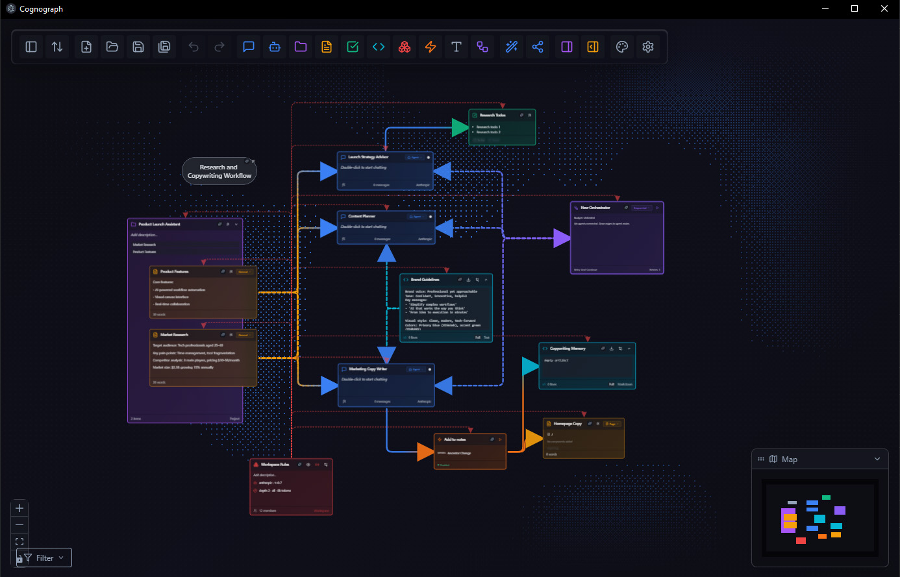
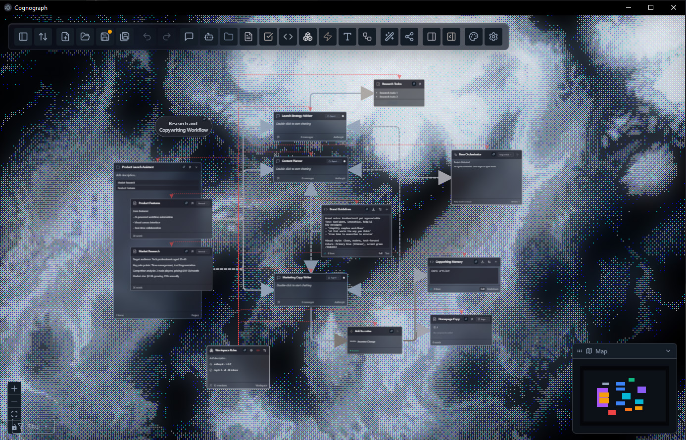
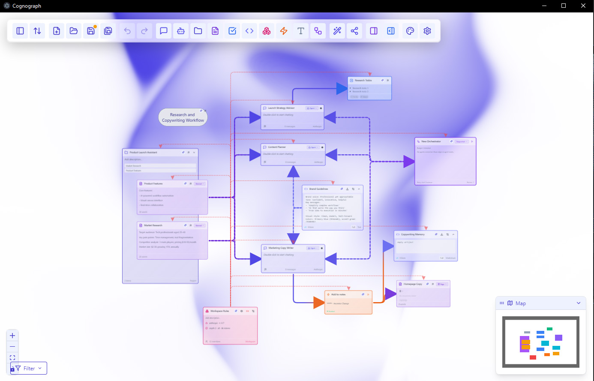
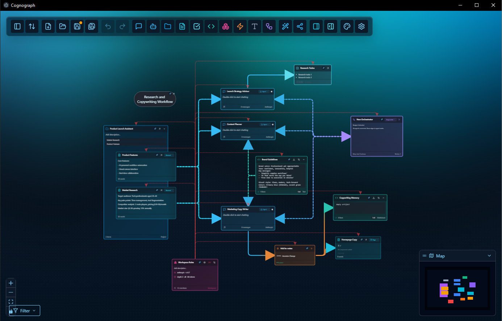
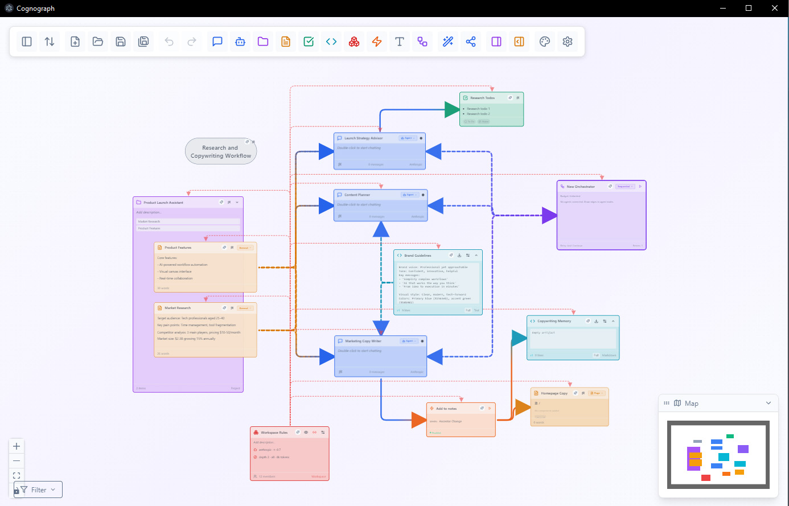

# Cognograph

**Connect your thinking. The AI follows.**

A spatial canvas where AI conversations, notes, tasks, and projects live as connected nodes. Draw a connection between two nodes and the AI reads both. Your layout is your prompt engineering.

## Screenshots

<div align="center">



*Spatial canvas with multiple node types and theme customization*

</div>

<details>
<summary><b>More screenshots</b> (click to expand)</summary>







</details>

<!-- TODO: Add demo GIF showing: create note → create conversation → connect them → AI responds with note context -->

---

## The Problem

You have 47 ChatGPT tabs open. One has your competitor analysis. One has your brand guidelines. One has that pricing breakdown you spent an hour on. You can't remember which is which, and every new conversation starts from zero.

AI chat interfaces treat each conversation as an island. But your work isn't islands — it's a graph. Ideas reference other ideas. Research feeds into planning. Decisions depend on context from three different threads. You end up copy-pasting between tabs, rewriting system prompts, and re-explaining things the AI already knows (somewhere, in some other conversation you can't find).

Cognograph fixes this by making the connections visible and functional. Put your thinking on a canvas. Connect the pieces. The AI reads the connections and understands what's relevant — no copy-pasting, no prompt engineering, no configuration. **The act of organizing your work IS the act of programming the AI.**

---

## Features

### Context Injection (the core innovation)

When you draw an edge between nodes, the system walks the graph via breadth-first traversal on inbound edges and builds the AI's context window automatically. Notes become reference material, Tasks become constraints, Projects define scope. Edge direction and weight control priority. Token budgets prevent runaway costs.

You don't write system prompts. You connect things.

### 8 Node Types

| Node | Purpose |
|------|---------|
| **Conversation** | Chat with AI, context-aware via connections |
| **Note** | Static content — research, guidelines, references |
| **Task** | Actionable items with status and priority |
| **Project** | Group and scope related nodes |
| **Artifact** | Files dropped onto the canvas or generated by AI |
| **Text** | Rich-text freeform blocks (TipTap editor) |
| **Action** | Spatial trigger zones on the canvas |
| **Workspace** | Top-level settings and defaults |

### More Capabilities

- **Spatial Triggers** — Drag a node into an Action zone and it auto-summarizes, auto-categorizes, or runs custom logic. Canvas position as a trigger condition.
- **Plan-Preview-Apply** — Ask the AI to reorganize your canvas. Ghost nodes show what's about to change. Refine conversationally. Apply atomically with per-operation undo.
- **Token Budget Tracking** — See how much context each connection contributes. Stay under limits without guessing.
- **20 Ambient Effects** — Living Grid, Topography, Aurora, Starfield, Fireflies, Rain, Particles, Iridescence, and more. Pure aesthetics, GPU-friendly.
- **Agent Mode** — Conversation nodes can act autonomously — creating, editing, and connecting nodes on the canvas based on your instructions.
- **Local-First** — No account. No cloud. Your data stays on your machine. Workspaces save to disk automatically.
- **MCP Server** — Expose your workspace to Claude Code and other MCP-compatible agents.

---

## Quick Start

```bash
git clone https://github.com/AurochsDigital/cognograph.git
cd cognograph
npm install
npm run dev
```

On first conversation, the app will ask for an API key. Paste it in and you're running.

### Requirements

- Node.js 18+
- npm 9+
- An API key from at least one provider (see below)

### API Key Setup

Open Settings (gear icon, top-right) and add keys for any provider you want to use:

- **Anthropic** — Claude models (default)
- **OpenAI** — GPT-4o, o1, etc.
- **Google Gemini** — Gemini Pro / Flash

Each conversation node can use a different provider. Set per-node or use workspace defaults.

---

## Supported Providers

| Provider | Status | Models |
|----------|--------|--------|
| Anthropic | Supported | Claude Sonnet, Opus, Haiku |
| OpenAI | Supported | GPT-4o, o1-mini, o1, etc. |
| Google Gemini | Supported | Gemini Pro, Flash |

---

## Tech Stack

| Layer | Technology |
|-------|------------|
| Desktop | Electron 33 |
| Frontend | React 18, TypeScript 5 |
| Canvas | React Flow (xyflow) |
| State | Zustand + Immer |
| Styling | Tailwind CSS 3 |
| Rich Text | TipTap |
| LLM SDKs | Anthropic, OpenAI, Google Generative AI |
| 3D/Effects | Three.js, R3F, OGL |
| Build | electron-vite, Vite |
| Testing | Vitest (788 tests), Playwright |

---

## Project Structure

```
src/
├── main/           # Electron main process (IPC, file I/O, LLM calls, MCP server)
├── preload/        # IPC bridge (type-safe API surface)
├── renderer/       # React app
│   ├── components/ # UI components + 8 node types
│   ├── stores/     # Zustand stores (34 stores)
│   ├── services/   # Agent tools, action executor, extraction
│   └── utils/      # Mutation executor, helpers
└── shared/         # Types shared across all processes
```

---

## The Story

I have ASD and severe combined-type ADHD. Files in folders don't work for me. Linear chat doesn't work for me. I need to see everything spatially, with connections I can trace with my eyes.

When I started working with AI daily — dozens of conversations, research, code, planning — I hit a wall. 47 tabs. Context lost between them. Redoing work because I couldn't find where I'd already done it. The tools weren't built for how I think.

Cognograph started as a tool for my own brain. Turns out a lot of brains need it — neurodivergent or not, most people think better when they can see everything at once.

---

## Contributing

Contributions are welcome. The codebase is TypeScript throughout with strict types, Zustand for state, and React Flow for the canvas layer.

Start with `ARCHITECTURE.md` at the project root — it explains how data flows through the system. `docs/guides/PITFALLS.md` covers common gotchas that'll save you time.

If you're not sure where to start, open an issue or check the [Issues](https://github.com/skovalik/cognograph/issues) page.

---

## Documentation

| Document | Purpose |
|----------|---------|
| [ARCHITECTURE.md](./ARCHITECTURE.md) | System design, data flow, components |
| [CONTRIBUTING.md](./CONTRIBUTING.md) | How to contribute |
| [docs/guides/PITFALLS.md](./docs/guides/PITFALLS.md) | Common bugs and solutions |
| [CHANGELOG.md](./CHANGELOG.md) | Release history |

---

## Patent Status

Patent pending. Four provisional patent applications filed February 2026 covering:

1. **Context Injection** — Graph-based automatic context assembly for AI conversations
2. **Spatial Agent Orchestration** — Canvas topology controlling agent permissions and behavior
3. **Spatial Triggers** — Canvas position as a trigger condition for automated workflows
4. **Plan-Preview-Apply** — Conversational plan refinement with ghost-node preview and atomic execution

---

## License

[AGPL-3.0](./LICENSE) — Open source with defensive patent pledge.

Use it, modify it, self-host it.

---

*Built by Stefan Kovalik in San Francisco. Designed to close the gap between how people think and how AI tools expect them to.*
