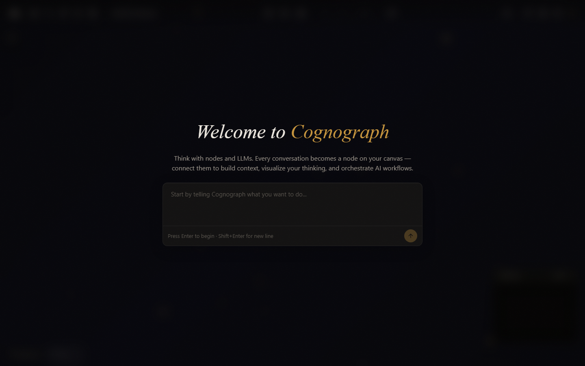
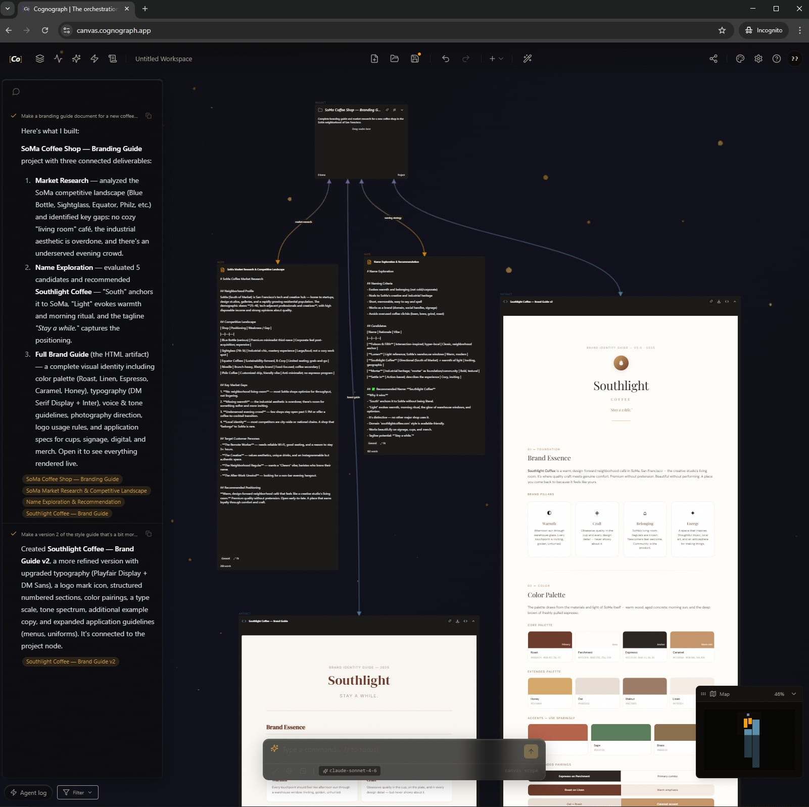
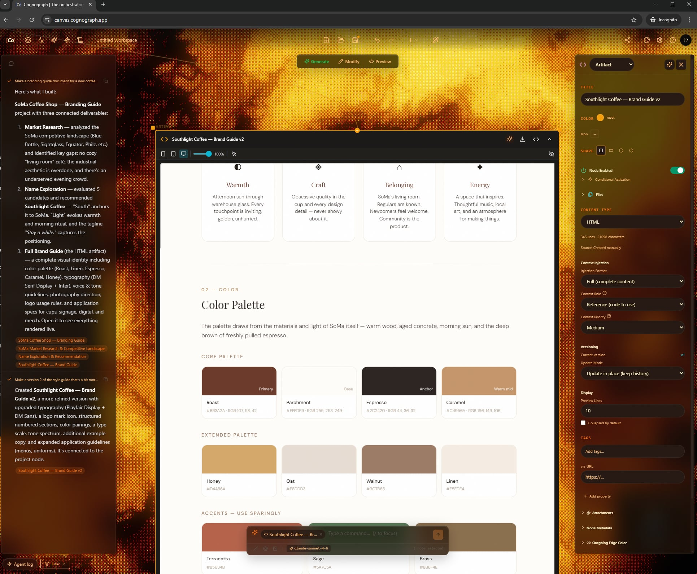
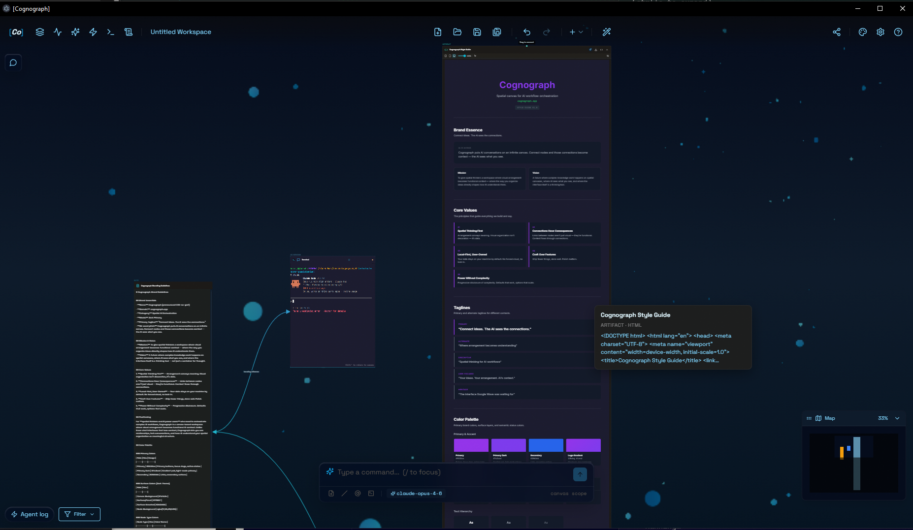
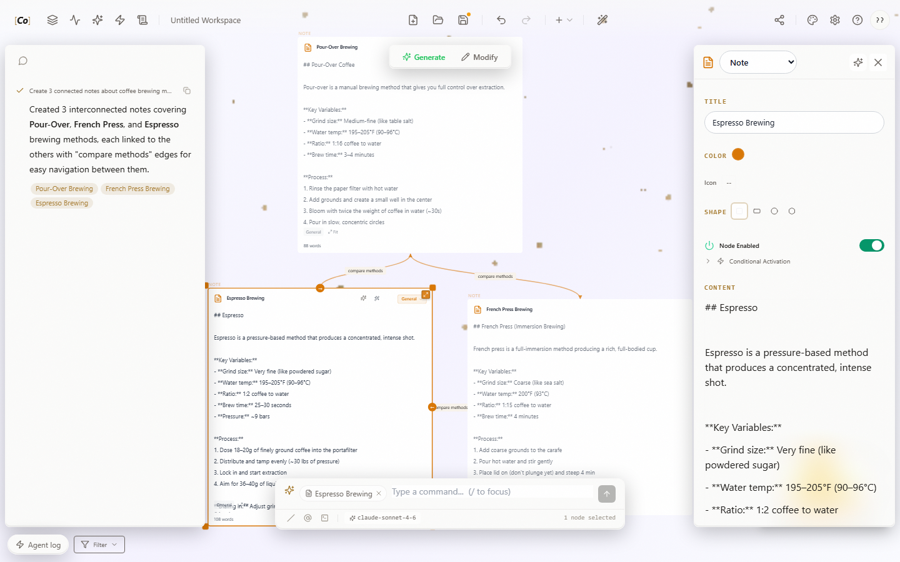
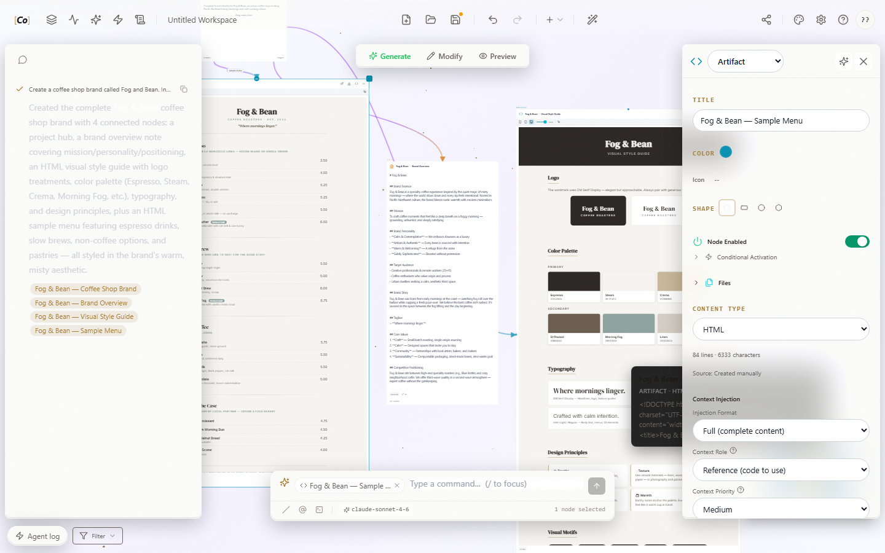
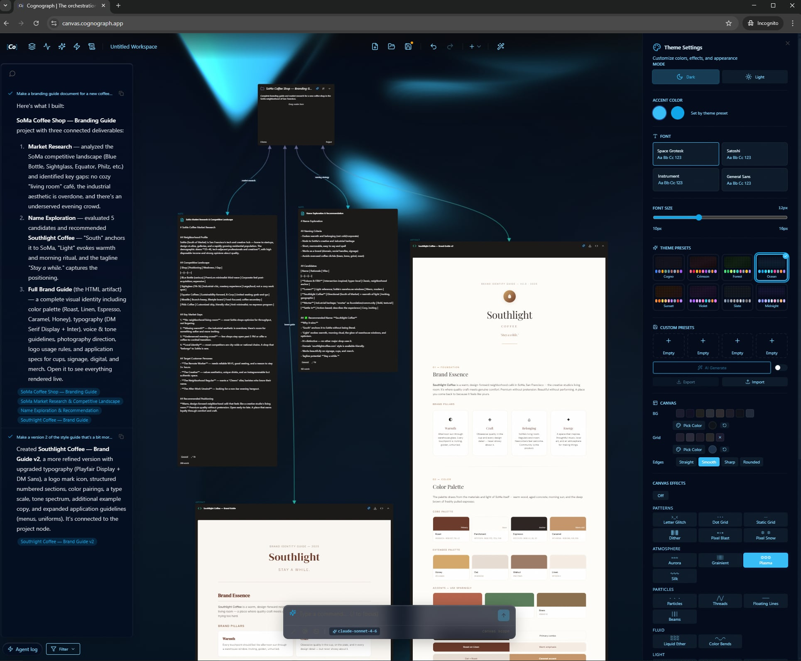
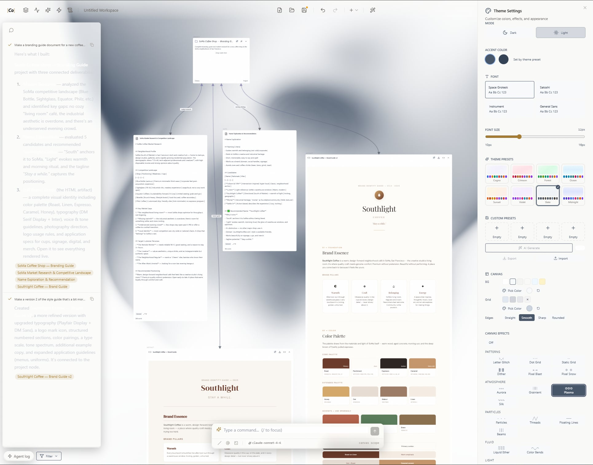

# Cognograph

**Connect your thinking. The AI follows.**

A spatial canvas where AI conversations, notes, tasks, and artifacts live as connected nodes. Draw a connection between two nodes and the AI reads both. Your layout is your prompt engineering.

Try it: **[canvas.cognograph.app](https://canvas.cognograph.app)** (browser) or clone and run locally (Electron).

<p align="center">
  <a href="screenshots/01-welcome.png"></a>
  <a href="screenshots/03-workspace-overview.png"></a>
  <a href="screenshots/02-brand-guide-generation.png"></a>
</p>
<p align="center">
  <a href="screenshots/04-canvas-desktop.png"></a>
  <a href="screenshots/07-connected-notes.png"></a>
  <a href="screenshots/08-fog-bean-brand.png"></a>
</p>
<p align="center">
  <a href="screenshots/05-dark-theme-settings.png"></a>
  <a href="screenshots/06-light-theme-settings.png"></a>
</p>

---

## The Problem

You have 47 ChatGPT tabs open. One has your competitor analysis. One has your brand guidelines. One has that pricing breakdown you spent an hour on. You can't remember which is which, and every new conversation starts from zero.

AI chat interfaces treat each conversation as an island. But your work isn't islands -- it's a graph. Ideas reference other ideas. Research feeds into planning. Decisions depend on context from three different threads.

Cognograph fixes this by making the connections visible and functional. Put your thinking on a canvas. Connect the pieces. The AI reads the connections and understands what's relevant. **The act of organizing your work IS the act of programming the AI.**

---

## What It Does

### Context Injection

The core innovation. Draw an edge between nodes and the system walks the graph via breadth-first traversal, assembling the AI's context window automatically. Notes become reference material. Tasks become constraints. Projects define scope.

You don't write system prompts. You connect things.

### Three Ways to Talk to AI

| Mode | How It Works | Best For |
|------|-------------|----------|
| **Chat** | Direct API call with canvas tools. You see every tool call. | Quick node creation, structured output |
| **Agent SDK** | Claude Pro subscription, autonomous multi-step execution | Complex workflows, batch operations |
| **CLI Terminal** | Embedded Git Bash with Claude Code + MCP tools | File operations, code tasks, anything terminal |

All three modes create nodes on the canvas. All three read context from connected nodes. Switch between them mid-project.

### HTML Artifact Preview

Artifact nodes with `contentType: html` render as live web previews directly on the canvas. The AI generates a full HTML page with inline CSS, and you see it rendered -- color swatches, hero sections, data dashboards, menu components. Not raw code. The actual page.

Nodes auto-size to match the rendered content height via iframe measurement. A 700-character HTML page gets a 700px-tall node. No clipping, no wasted space.

### Semantic Zoom

The canvas adapts to your zoom level. No mode switching.

| Zoom | What You See |
|------|-------------|
| **Far** | Colored rectangles, icon + title. Cluster summaries. Weak edges hidden. |
| **Overview** | Property badges, metadata, edge labels. |
| **Mid** | Full node content reveals progressively. |
| **Close** | Complete content, property panels, all handles. |
| **Expanded** | In-place artboard mode for deep work. |

### 9 Node Types

| Node | Purpose |
|------|---------|
| **Conversation** | Chat with AI, context-aware via connections |
| **Note** | Static content -- research, guidelines, references |
| **Task** | Actionable items with status and priority |
| **Project** | Group and scope related nodes |
| **Artifact** | Code, HTML previews, or generated files |
| **Text** | Rich-text freeform blocks (TipTap editor) |
| **Action** | Spatial trigger zones on the canvas |
| **Orchestrator** | Multi-step agent workflows |
| **Workspace** | Top-level settings and defaults |

### Canvas Intelligence

- **Canvas Districts** -- Named spatial zones with visual tinting
- **Canvas Table of Contents** -- Searchable outline, jump to any node
- **Context Visualization** -- See which nodes feed context where
- **Calm Mode** -- Strips all secondary UI for focus
- **Session Re-Entry** -- Surfaces recent work when you come back
- **Landmark Nodes** -- Priority context injection regardless of distance
- **Z-Key Navigation** -- Hold Z for bird's-eye minimap, drag to jump

### More

- **Spatial Triggers** -- Drag nodes into Action zones for auto-processing
- **Plan-Preview-Apply** -- AI proposes canvas changes as ghost nodes, you approve
- **20+ Ambient Effects** -- Aurora, particles, topography, living grid. GPU-friendly.
- **Template System** -- Save and load workspace templates
- **Export** -- Markdown, HTML, or JSON
- **Keyboard Shortcuts** -- 60+ shortcuts, all customizable. Press `?` for the reference.
- **Error Recovery** -- ErrorBoundary wraps the canvas. One bad node won't crash the app.
- **Offline Indicator** -- Network status visible, dirty state saved on close.
- **Local-First** -- No account required. Data stays on your machine.
- **MCP Server** -- Expose your workspace to Claude Code and other agents.

---

## Quick Start

### Browser (no install)

Go to **[canvas.cognograph.app](https://canvas.cognograph.app)** and paste an API key when prompted. Your data stays in your browser (IndexedDB).

### Local (Electron)

```bash
git clone https://github.com/skovalik/cognograph.git
cd cognograph
npm install
npm run dev
```

On first launch, the onboarding wizard walks you through API key setup and creates your first conversation node.

### Requirements

- Node.js 20+
- npm 9+
- An API key from at least one provider

### Supported Providers

| Provider | Models |
|----------|--------|
| Anthropic | Claude Sonnet, Opus, Haiku |
| OpenAI | GPT-4o, o1, etc. |
| Google Gemini | Gemini Pro, Flash |

Each conversation can use a different provider. Set per-node or use workspace defaults.

---

## Tech Stack

| Layer | Technology |
|-------|------------|
| Desktop | Electron 35 |
| Frontend | React 18, TypeScript 5 |
| Canvas | React Flow (xyflow) v12 |
| State | Zustand + Immer (47 stores) |
| Styling | Tailwind CSS 4 |
| Rich Text | TipTap |
| AI | Anthropic SDK, OpenAI SDK, Google AI SDK, Claude Agent SDK |
| Effects | Three.js, React Three Fiber |
| Build | electron-vite, Vite |
| Testing | Vitest (1,508+ tests), Playwright |
| Web | Cloudflare Pages, Hono orchestrator on Fly.io |

---

## Project Structure

```
src/
├── main/           # Electron main process (IPC, LLM calls, MCP server, agent SDK)
├── preload/        # IPC bridge (type-safe API surface)
├── renderer/       # React app
│   ├── components/ # UI components + 9 node types
│   ├── stores/     # Zustand stores (47 stores)
│   ├── services/   # Chat tools, agent tools, layout pipeline
│   ├── sync/       # File sync, auto-save, workspace persistence
│   └── utils/      # Layout algorithms, node sizing, context builder
├── plugins/        # Plugin system (Notion, etc.)
└── shared/         # Types shared across all processes
```

---

## The Story

I have ASD and severe combined-type ADHD. Files in folders don't work for me. Linear chat doesn't work for me. I need to see everything spatially, with connections I can trace with my eyes.

When I started working with AI daily -- dozens of conversations, research, code, planning -- I hit a wall. 47 tabs. Context lost between them. Redoing work because I couldn't find where I'd already done it. The tools weren't built for how I think.

Cognograph started as a tool for my own brain. It's been my daily driver for months now. Turns out a lot of brains need it -- neurodivergent or not, most people think better when they can see everything at once.

---

## Contributing

Contributions are welcome. The codebase is TypeScript throughout with strict types, Zustand for state, and React Flow for the canvas layer.

Start with `ARCHITECTURE.md` for how the system works and `FEATURES.md` for what it does. `docs/guides/PITFALLS.md` covers the gotchas that'll save you time.

If you're not sure where to start, open an issue.

---

## Documentation

| Document | Purpose |
|----------|---------|
| [ARCHITECTURE.md](./ARCHITECTURE.md) | System design, data flow, components |
| [CONTRIBUTING.md](./CONTRIBUTING.md) | How to contribute |
| [docs/guides/PITFALLS.md](./docs/guides/PITFALLS.md) | Common bugs and how to avoid them |

---

## Patent Status

Patent pending. Four provisional patent applications filed February 2026 covering:

1. **Context Injection** -- Graph-based automatic context assembly for AI conversations
2. **Spatial Agent Orchestration** -- Canvas topology controlling agent permissions and behavior
3. **Spatial Triggers** -- Canvas position as a trigger condition for automated workflows
4. **Plan-Preview-Apply** -- Conversational plan refinement with ghost-node preview and atomic execution

---

## License

[AGPL-3.0](./LICENSE) with Defensive Patent Pledge. Patent pending.

**Free for personal use.** Commercial use requires a commercial license -- [contact me](mailto:stefan@aurochs.agency) for details.

If you distribute modified versions or run them as a network service, AGPL-3.0 requires you to release your source code under the same license.

---

*Built by [Stefan Kovalik](https://aurochs.agency) in San Francisco. Designed to close the gap between how people think and how AI tools expect them to.*
