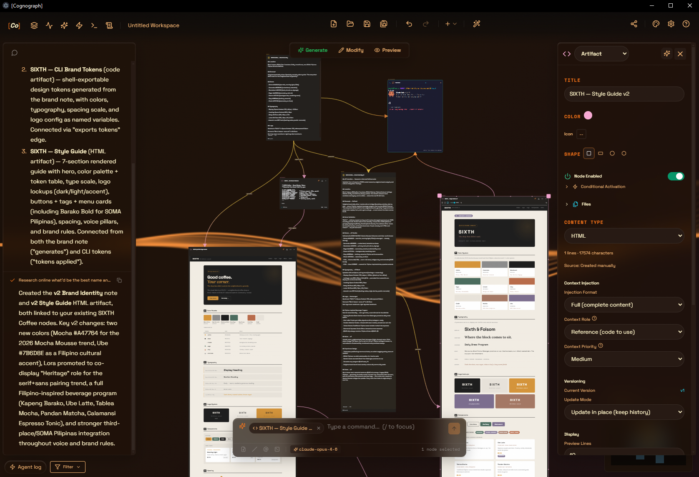
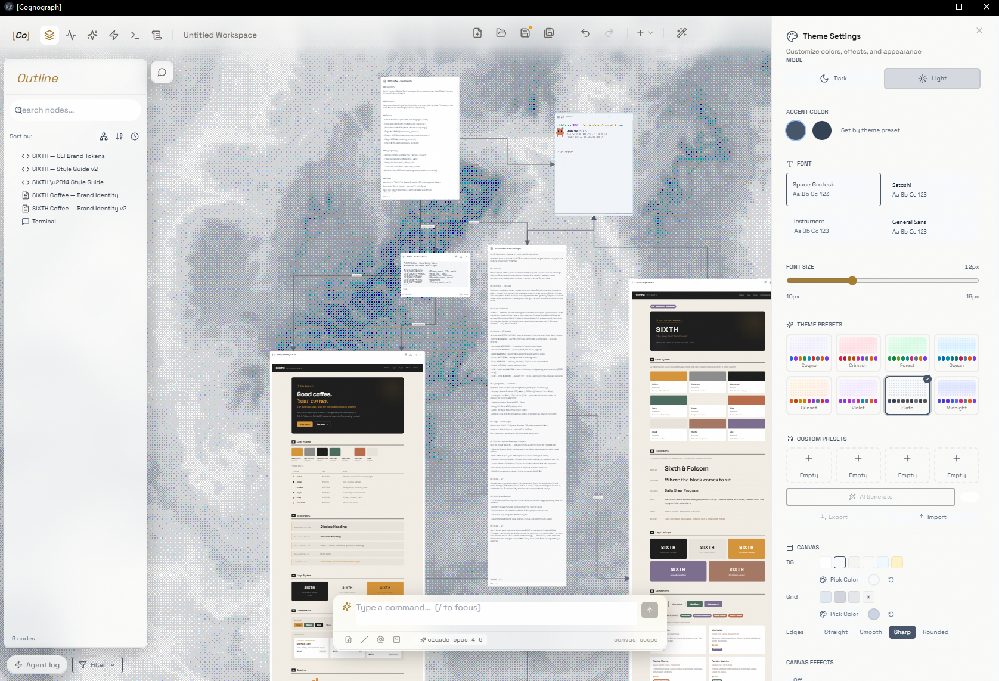
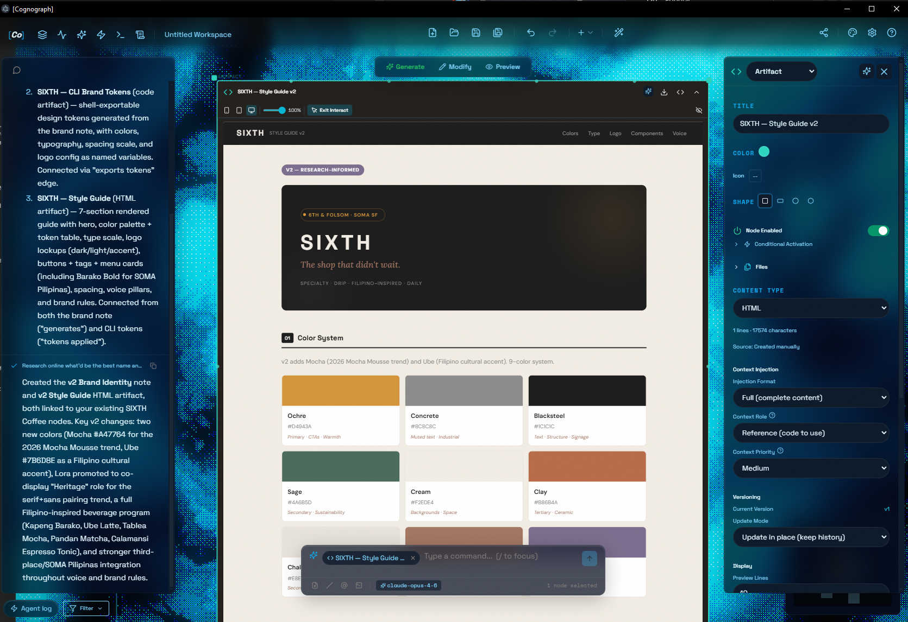
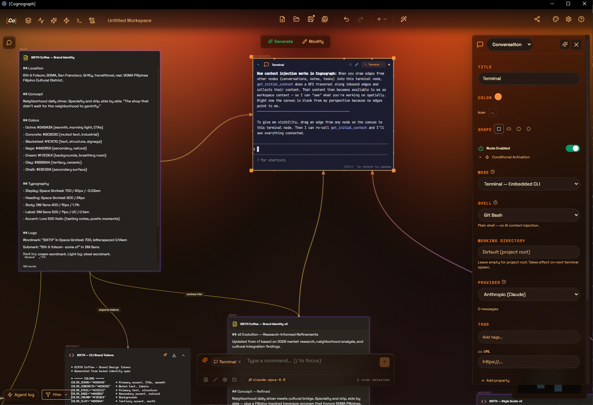
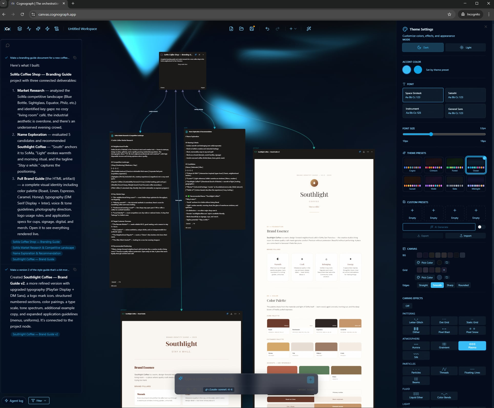
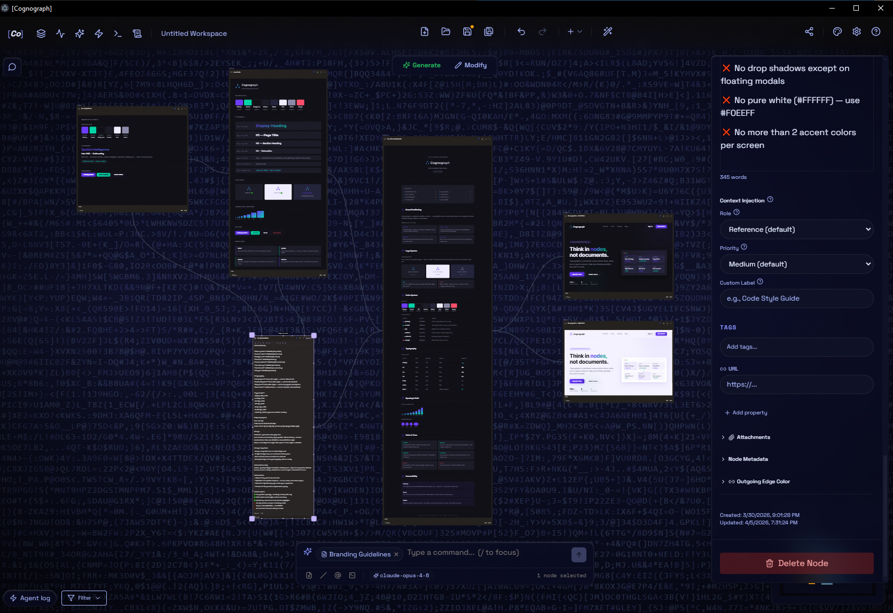

# Cognograph

**The gap between how you think and how AI tools expect you to think is the bottleneck. Not the models.**

You're managing context across dozens of tabs, re-explaining what the AI should already know, losing threads between conversations that should be connected. Every AI tool treats context as invisible plumbing. System prompts. Config files. Conversation history you can't see or organize.

Try it: **[cognograph.app/workspace](https://cognograph.app/workspace)** (browser) or clone and run locally (Electron).

---

I'm a designer and developer with 15 years of experience and a BA in Cognitive Psychology. I have ASD and severe combined-type ADHD. Files in folders don't work for me. Linear chat doesn't work for me. I built the tool that does.

It's been my daily driver for months. Turns out spatial thinking isn't a neurodivergent workaround. It's how most people process complex information when given the option.

<p align="center">
  <a href="cognograph-screenshots/02-coffee-shop-dark.png"></a>
  <a href="cognograph-screenshots/03-coffee-shop-light.png"></a>
  <a href="cognograph-screenshots/04-coffee-shop-teal.png"></a>
  <a href="cognograph-screenshots/05-coffee-shop-amber.png"></a>
  <a href="cognograph-screenshots/06-multi-artifact-preview.png"></a>
  <a href="cognograph-screenshots/07-coffee-shop-navy.png"></a>
</p>

---

## Spatial Graph Traversal Cuts API Costs Up to 80%

When you connect nodes on the canvas, Cognograph walks the graph via breadth-first traversal and assembles only the relevant context for each AI call. Connected nodes become the AI's working memory. Notes become reference material, tasks become constraints, projects define scope. You send what matters, not everything.

By explicitly linking what's relevant instead of dumping entire conversation histories, you avoid hallucination-inducing bloat and dramatically reduce token usage. The spatial layout isn't decoration. It's a token optimization layer.

Flat-rate AI subscriptions are dying. The context windows are too expensive to subsidize. Cognograph's spatial graph injects what's connected, so your per-call token usage drops whether you're on a paid API or running local models.

### Bring Your Own Key. Or No Key at All.

Chat and Agent modes take API keys from Anthropic, OpenAI, Google, and OpenRouter. Terminal nodes spawn an embedded CLI with full MCP tool access to your canvas. Or skip the API: connect Ollama for local inference with Llama, Mistral, Phi, or any GGUF model. Three interaction modes, one canvas. Switch providers per node.

### Your Data Stays on Your Machine

No account required. No telemetry. Workspaces save as local JSON files. API keys are encrypted via your OS keychain, never sent to Cognograph servers. Run Ollama or any local LLM and keep everything fully air-gapped. The Electron app runs offline with zero server dependency.

---

## Quick Start

### Browser (no install)

Go to **[cognograph.app/workspace](https://cognograph.app/workspace)** and paste an API key when prompted. Your data stays in your browser (IndexedDB).

### Local (Electron)

```bash
git clone https://github.com/skovalik/cognograph.git
cd cognograph
npm install
npm run dev
```

Requires Node.js 20+. Bring your own API key, connect Ollama for local inference, or use Terminal mode with any CLI agent.

---

## How It Works

**9 node types, each unlocking something different:**

| Node | What It Enables |
|------|----------------|
| **Conversation** | Chat, Agent, or Terminal mode with context from every connected node |
| **Artifact** | 13 content types rendered live on canvas: HTML pages, 3D models, SVG, Mermaid diagrams, audio, video, code, markdown, JSON, CSV, images. Not raw code. The rendered output. |
| **Action** | Visual programming. 13 trigger types: proximity, region-enter, region-exit, cron schedules, property changes, connection events, cluster size. Position on the canvas IS the programming language. |
| **Orchestrator** | Multi-agent pipelines. 4 strategies: sequential, parallel, conditional, coordinator. Budget caps per agent. Canvas topology IS the execution graph. |
| **Note** | Persistent context. Modes: general, persona, page, component, content model, config. Connected notes become the AI's long-term memory. |
| **Task** | Status, priority, complexity, due dates. Connected tasks become agent constraints automatically. |
| **Project** | Scope boundaries with linked folders. File trees, extension filters. Everything inside inherits context. |

**Three ways to talk to AI:**

| Mode | What It Does | Best For |
|------|-------------|----------|
| **Chat** | Direct API call with canvas tools. Real-time token cost tracking. | Quick tasks, structured output |
| **Agent** | Autonomous multi-step execution with persistent memory across runs. | Complex workflows, batch operations |
| **Terminal** | Embedded CLI (Claude Code, Git Bash, PowerShell). MCP tools read the canvas. | Code, files, anything terminal |

All three read context from connected nodes. Switch between them mid-project.

---

## What Else It Does

- **Spatial Triggers.** 13 trigger types: proximity detection, region enter/exit, cron schedules, property changes, connection events, cluster size thresholds, child completion, ancestor changes, isolation detection. Drag a node into a zone, automation fires. No scripting required.
- **Plan-Preview-Apply.** AI proposes canvas mutations as ghost nodes you can see before committing. Accept or reject atomically. Undo 20 node operations with one Ctrl+Z.
- **Agent Memory.** Agents persist key-value memory across runs. An agent that researches your codebase today remembers what it found tomorrow.
- **Live Artifact Rendering.** 13 content types rendered directly on canvas: HTML with full CSS, SVG, Mermaid diagrams, 3D models (GLB/GLTF with Three.js), audio, video, code with syntax highlighting, markdown, JSON, CSV, images. Artifacts version-track up to 10 revisions.
- **Semantic Zoom.** Five levels that adapt automatically. Ultra-far: cluster shapes. Far: titles and badges. Mid: lede text. Close: full content. Ultra-close: expanded toolbar and property panels.
- **MCP Server.** Run `--mcp-server` and your entire knowledge graph becomes a tool that Claude Code and other agents can query, search, create nodes, and modify edges.

---

## What's Next

**Multiplayer.** Real-time collaboration via Hocuspocus (Y.js CRDT). The canvas becomes a shared workspace for teams. The infrastructure is built. UI polish is in progress.

---

## Architecture

| Layer | Technology |
|-------|------------|
| Desktop | Electron 35 |
| UI | React 18, TypeScript 5, Tailwind CSS 3 |
| Canvas | React Flow (@xyflow/react) v12 |
| State | Zustand + Immer (46+ stores) |
| Rich Text | TipTap with collaboration |
| AI | Anthropic SDK, OpenAI SDK, Google AI SDK, Claude Agent SDK |
| Terminal | xterm.js |
| 3D/Effects | Three.js, React Three Fiber |
| Sync | Yjs, Hocuspocus, Dexie (IndexedDB) |
| Build | electron-vite, Vite |
| Testing | Vitest (25,000+ test cases), Playwright (e2e) |

937 source files across 6 process layers. See [ARCHITECTURE.md](./ARCHITECTURE.md) for the full system design.

---

## Supported Providers

| Provider | Connection |
|----------|-----------|
| Anthropic | API key (Claude Sonnet, Opus, Haiku) |
| OpenAI | API key (GPT-4o, o1, o3) |
| Google Gemini | API key (Gemini Pro, Flash) |
| OpenRouter | API key (access to 100+ models) |
| Ollama | Local, air-gapped (Llama, Mistral, Phi, any GGUF model) |
| CLI Agents | Via Terminal mode (Claude Code, Aider, or any CLI tool) |

Each conversation can use a different provider. Set per-node or use workspace defaults.

---

## Patent Status

Patent pending (4 provisional applications, February 2026). Defensive Patent Pledge: Cognograph will not assert patents against any party unless that party first asserts patent claims against Cognograph, its users, or contributors.

---

## Project Structure

```
src/
├── main/           # Electron main process (IPC, LLM calls, MCP server, agent SDK)
├── preload/        # IPC bridge (type-safe API surface)
├── renderer/       # React app
│   ├── components/ # UI components + 9 node types
│   ├── stores/     # Zustand stores (47 stores)
│   ├── services/   # Chat tools, agent tools, layout pipeline
│   ├── sync/       # File sync, auto-save, workspace persistence
│   └── utils/      # Layout algorithms, node sizing, context builder
├── plugins/        # Plugin system (Notion, etc.)
└── shared/         # Types shared across all processes
```

---

## The Story

I have ASD and severe combined-type ADHD. Files in folders don't work for me. Linear chat doesn't work for me. I need to see everything spatially, with connections I can trace with my eyes.

When I started working with AI daily -- dozens of conversations, research, code, planning -- I hit a wall. 47 tabs. Context lost between them. Redoing work because I couldn't find where I'd already done it. The tools weren't built for how I think.

Cognograph started as a tool for my own brain. It's been my daily driver for months.

---

## Contributing

Contributions welcome. TypeScript throughout, strict types, Zustand state, React Flow canvas layer.

Start with [ARCHITECTURE.md](./ARCHITECTURE.md) for how the system works. [docs/guides/PITFALLS.md](./docs/guides/PITFALLS.md) covers the gotchas. Open an issue if you're not sure where to start.

---

## License

[AGPL-3.0](./LICENSE) with Defensive Patent Pledge.

Free for personal use. Commercial use requires a commercial license. [Contact me](mailto:stefan@aurochs.agency) for details.

If you distribute modified versions or run them as a network service, AGPL-3.0 requires you to release your source code under the same license.

---

**[aurochs.agency](https://aurochs.agency)** · stefan@aurochs.agency
