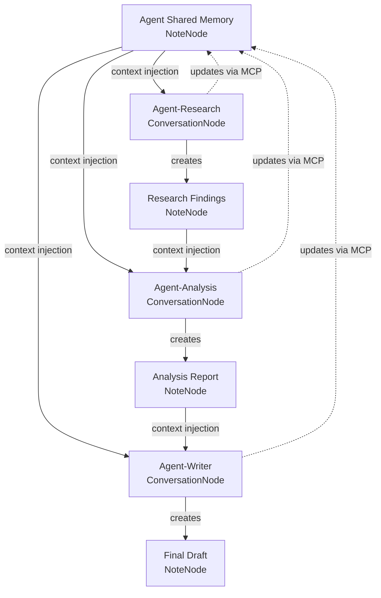
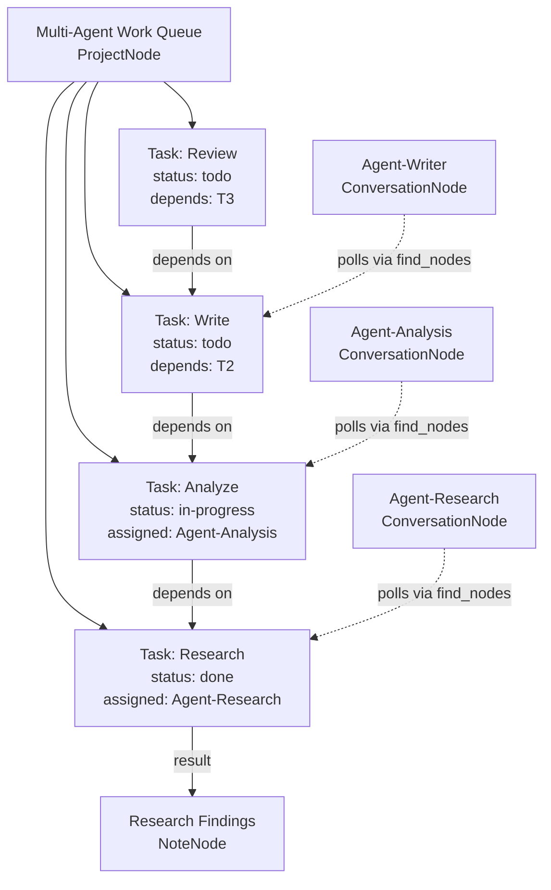
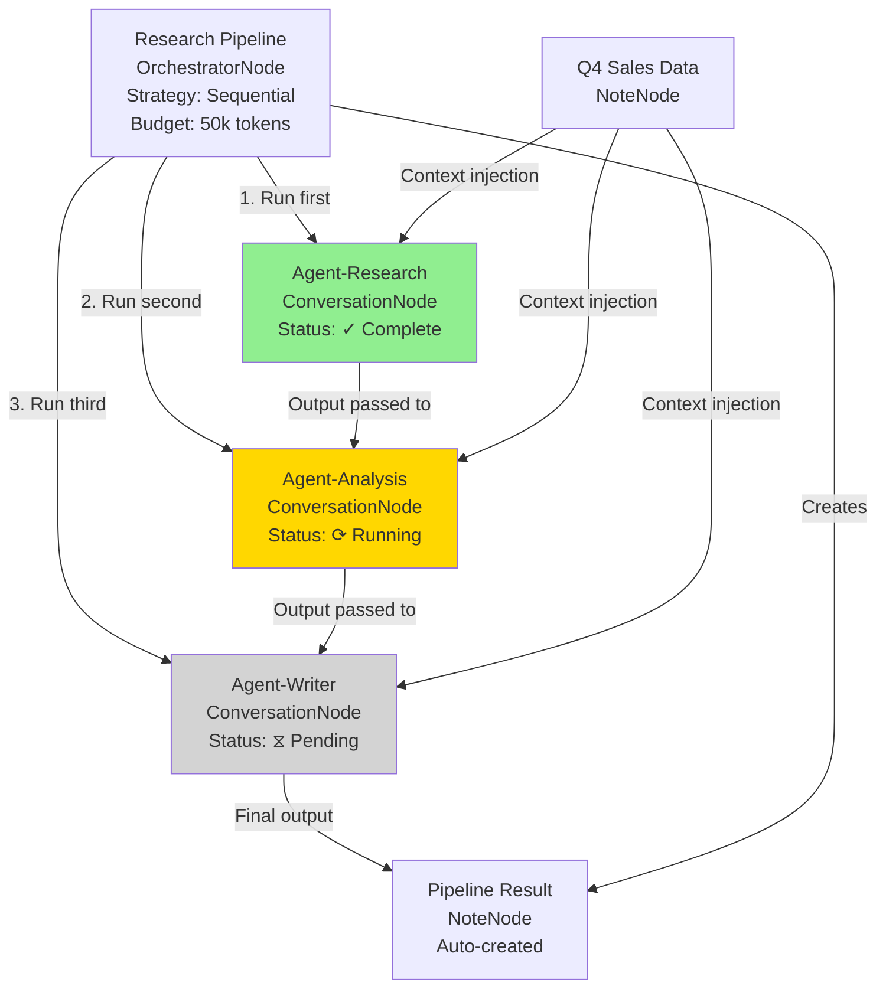

# Multi-Agent Coordination in Cognograph

> **Version:** v0.1.0
> **Last Updated:** 2026-02-12
> **Status:** Current feature set (not future roadmap)

## Overview

Multi-agent coordination is the ability for multiple AI agents to work together on complex tasks by sharing information, dividing work, and building on each other's outputs. In Cognograph, agents are instances of Claude running in separate ConversationNodes, each with its own memory, context, and specialization.

### Why Multi-Agent Coordination?

**Complexity Management**
Break down large problems into specialized subtasks (research, analysis, writing, coding, review).

**Parallel Processing**
Run multiple agents simultaneously to speed up independent work streams.

**Expertise Specialization**
Configure each agent with domain-specific knowledge, prompts, and tools.

**Quality Through Iteration**
Chain agents in review cycles (draft → critique → revise → approve).

### When to Use Multi-Agent Coordination

| Use Case | Pattern | Example |
|----------|---------|---------|
| **Complex research** | Sequential pipeline | Fetcher → Analyzer → Summarizer |
| **Content creation** | Draft + review | Writer → Editor → Fact-checker |
| **Parallel analysis** | Simultaneous processing | 3 agents analyze different datasets |
| **Long-running tasks** | Work queue | Agents pull tasks from shared NoteNode |
| **Collaborative brainstorm** | Shared memory | Agents contribute ideas to shared note |

### Three Coordination Methods Available Today

Cognograph supports three distinct coordination patterns using existing features:

1. **NoteNode as Shared Memory** - Agents read/write to a shared note
2. **TaskNode as Work Queue** - Agents create and claim structured tasks
3. **Orchestrator Coordination** - OrchestratorNode runs agents in workflows

Each method has different strengths, limitations, and ideal use cases.

---

## Method 1: Shared Memory via NoteNode

### How It Works

The NoteNode shared memory pattern uses a single NoteNode as a "bulletin board" where multiple agents can post updates, claim tasks, and read each other's progress. Agents access the note through **context injection** (connecting the note to their ConversationNode) and modify it using the **update_node_content** MCP tool.

**Key Mechanism: Context Injection**
When you connect a NoteNode to a ConversationNode, the note's content is automatically injected into the agent's system prompt on every message. The agent sees the note as read-only context. To modify the note, the agent calls `update_node_content` with the note's node ID.

**Data Format**
Use structured markdown for easy agent parsing:

```markdown
# Agent Task Queue

## Available Tasks
- [ ] Research competitors for feature X (assigned: none)
- [ ] Analyze user feedback from Q4 (assigned: Agent-Analysis)
- [ ] Draft v2 product spec (assigned: none)

## In Progress
- Agent-Analysis: Analyzing user feedback (started 14:23)

## Completed
- [x] Research market trends (Agent-Research, completed 14:10)
  - Result: See note "Market Trends Q4 2025"
```

### When to Use

**Best For:**
- Collaborative research (agents contribute findings to shared knowledge base)
- Status updates (agents report progress to human + other agents)
- Task assignment (simple work queue without TaskNode clutter)
- Brainstorming (agents build on each other's ideas)

**Not Ideal For:**
- High-frequency updates (context injection can get slow with large notes)
- Structured data (no schema validation, agents must parse markdown)
- Concurrent edits (agents may overwrite each other if editing simultaneously)

### Step-by-Step Setup

#### 1. Create Shared Memory NoteNode

**Via Toolbar:**
- Click "Add Note" button
- Title: `Agent Shared Memory`
- Set mode: `basic` (or `page`/`component` if you need richer structure)

**Via Command Palette:**
- Press `Ctrl+K` (Windows) or `Cmd+K` (Mac)
- Type "Create Note"
- Enter title and confirm

#### 2. Initialize Note Structure

Double-click the note to edit, add structure:

```markdown
# Multi-Agent Task Queue

## Instructions for Agents
- Check "Available Tasks" before asking for work
- To claim a task: move it to "In Progress" and add your name
- When done: move to "Completed" and link to result node
- Update progress every 15 minutes

## Available Tasks
- [ ] Task 1 (assigned: none)
- [ ] Task 2 (assigned: none)

## In Progress
(empty)

## Completed
(empty)

## Notes
(agents can add findings here)
```

#### 3. Create Agent ConversationNodes

Create one ConversationNode per agent role:

**Agent 1: Research Agent**
- Create ConversationNode
- Title: `Agent-Research`
- System prompt: "You are a research specialist. Check the 'Agent Shared Memory' note for tasks. When you claim a task, update the note with your status. When done, create a new NoteNode with your findings and link it in Completed."

**Agent 2: Analysis Agent**
- Create ConversationNode
- Title: `Agent-Analysis`
- System prompt: "You are an analysis specialist. Check the shared memory for research results to analyze."

**Agent 3: Writing Agent**
- Create ConversationNode
- Title: `Agent-Writer`
- System prompt: "You are a writing specialist. Check shared memory for analysis results to write up."

#### 4. Connect All Agents to Shared Memory

For each agent ConversationNode:
1. Drag from agent's connection handle to the NoteNode
2. In the ConnectionPropertiesPanel, confirm edge type is `inbound` (note → agent)
3. Enable "Context Injection" (should be on by default)

**Result:** All agents now see the note content in their system prompt.

#### 5. Give Agents Update Permission

In each agent's initial message or system prompt, include:

```
You have access to the following MCP tools:
- update_node_content: Update the shared memory note
- find_nodes: Search for nodes by title or type
- create_node: Create new notes with your findings

The shared memory note ID is: [node-id]
(Or: find it by searching for title "Agent Shared Memory")
```

#### 6. Start Coordination

Send a message to Agent-Research:

```
Check the shared memory for available tasks. If there's a research task, claim it and begin work. Update your status every 15 minutes.
```

The agent will:
1. Read the note content (via context injection)
2. Find an available task
3. Call `update_node_content` to move task to "In Progress"
4. Do the work
5. Create a result NoteNode
6. Update shared memory to mark task completed

### Example Workspace Structure

```
┌─────────────────────────┐
│  Agent Shared Memory    │ ← Central coordination hub
│  (NoteNode)             │
└───────┬─────────────────┘
        │
        ├──────────────────┐
        │                  │
        ▼                  ▼
┌──────────────┐   ┌──────────────┐   ┌──────────────┐
│ Agent-       │   │ Agent-       │   │ Agent-       │
│ Research     │   │ Analysis     │   │ Writer       │
│ (Conv)       │   │ (Conv)       │   │ (Conv)       │
└──────┬───────┘   └──────┬───────┘   └──────┬───────┘
       │                  │                  │
       │ creates          │ creates          │ creates
       ▼                  ▼                  ▼
┌──────────────┐   ┌──────────────┐   ┌──────────────┐
│ Research     │   │ Analysis     │   │ Final        │
│ Findings     │   │ Report       │   │ Draft        │
│ (Note)       │   │ (Note)       │   │ (Note)       │
└──────────────┘   └──────────────┘   └──────────────┘
```

**Mermaid Diagram:**



### Pros & Cons

#### Pros
✅ **Works today** - No future features required
✅ **Human-readable** - You can see agent coordination in plain markdown
✅ **Flexible** - Agents can add any structure they need
✅ **Leverages context injection** - Automatic prompt integration
✅ **Simple mental model** - Just a shared note everyone can read/write

#### Cons
❌ **Manual parsing** - Agents must parse markdown, no structured API
❌ **Concurrent edit conflicts** - Two agents editing simultaneously will conflict
❌ **No schema validation** - Agents can break the format
❌ **Polling required** - Agents don't get notified of changes, must re-check
❌ **Context window growth** - Large notes bloat every agent message

### Example Agent Prompts

#### Research Agent System Prompt

```
You are Agent-Research, a research specialist in a multi-agent team.

COORDINATION PROTOCOL:
1. At the start of each session, check the "Agent Shared Memory" note (injected in your context)
2. Look for tasks under "Available Tasks" that match your expertise
3. To claim a task:
   - Use update_node_content to move the task to "In Progress"
   - Add your agent name and timestamp
4. Work on the task:
   - Create a new NoteNode with your findings
   - Title it descriptively (e.g., "Research: Market Trends Q4")
5. When complete:
   - Use update_node_content to move task to "Completed"
   - Include link to your result note
6. Update status every 15 minutes if working >30 min

AVAILABLE TOOLS:
- update_node_content(node_id, content): Update shared memory
- create_node(type, title, content): Create result notes
- find_nodes(filters): Search for nodes

TASK FORMAT:
Available tasks look like:
- [ ] Research competitors for X (assigned: none)

To claim:
- [ ] Research competitors for X (assigned: Agent-Research, started 14:23)

To complete:
- [x] Research competitors for X (Agent-Research, completed 14:45)
  - Result: See note "Research: Competitors for X"
```

#### Analysis Agent Initial Message

```
Welcome, Agent-Analysis. You are part of a multi-agent research team.

Your role: Analyze research findings and produce structured insights.

Check the shared memory note for:
1. Completed research tasks (under "Completed")
2. Available analysis tasks (under "Available Tasks")

When you find research to analyze:
1. Claim an analysis task (or create one if research is waiting)
2. Read the research note via context (connect it to yourself)
3. Perform analysis
4. Create analysis report as new NoteNode
5. Update shared memory with completion status

Start by checking the shared memory and reporting what you see.
```

---

## Method 2: Work Queue via TaskNode

### How It Works

The TaskNode work queue pattern uses TaskNodes as structured work items with built-in status tracking, priority, and metadata fields. Agents discover tasks using the **find_nodes** MCP tool, claim them by updating properties, and mark progress through status changes.

**Key Advantages Over NoteNode:**
- **Structured data** - status, priority, description, properties are separate fields
- **Visual workflow** - Tasks appear as nodes on canvas, color-coded by status
- **Built-in metadata** - No need to parse markdown for task state

**Key Mechanism: Properties Field**
TaskNodes have a freeform `properties` object (key-value pairs). Agents can use this for:
- `assigned_to`: Agent name claiming the task
- `created_by`: Agent who created the task
- `dependencies`: Array of node IDs this task depends on
- `result_node_id`: ID of the node containing task results
- `started_at`: Timestamp when claimed
- `completed_at`: Timestamp when finished

### When to Use

**Best For:**
- Visual task management (see all tasks on canvas, color-coded by status)
- Complex task graphs (dependencies between tasks)
- Long-running projects (tasks persist across sessions)
- Human oversight (you can manually reassign, reprioritize, or cancel tasks)

**Not Ideal For:**
- High task volume (canvas gets cluttered with 50+ task nodes)
- Rapid iteration (creating/deleting many tasks is slow)
- Shared notes (TaskNodes don't support collaborative text editing)

### Step-by-Step Setup

#### 1. Create Work Queue Container (Optional)

Create a ProjectNode or WorkspaceNode to group all tasks:

**Via Command Palette:**
- Press `Ctrl+K`
- Type "Create Project"
- Title: `Multi-Agent Work Queue`
- Description: "Coordination hub for agent tasks"

#### 2. Create Agent TaskNodes

Each task is a separate TaskNode. Create via:

**Toolbar:** Click "Add Task" button

**Command Palette:** `Ctrl+K` → "Create Task"

**Agent MCP Tool:** Agent calls `create_node(type: 'task', title: '...', content: '...')`

**Example Task Structure:**

**Task 1:**
- Title: `Research market trends Q4 2025`
- Description: `Analyze competitor positioning, pricing changes, and market share shifts`
- Status: `todo`
- Priority: `high`
- Properties:
  ```json
  {
    "assigned_to": "none",
    "created_by": "Agent-Coordinator",
    "skills_required": ["research", "market_analysis"],
    "estimated_time": "30min"
  }
  ```

**Task 2:**
- Title: `Analyze research findings`
- Description: `Extract key insights from research note`
- Status: `todo`
- Priority: `medium`
- Properties:
  ```json
  {
    "assigned_to": "none",
    "created_by": "Agent-Coordinator",
    "dependencies": ["<research-task-node-id>"],
    "skills_required": ["analysis"]
  }
  ```

#### 3. Create Agent ConversationNodes

**Agent-Coordinator** (creates and assigns tasks):
```
You are the coordinator. Your job:
1. Break down complex requests into TaskNodes
2. Set priorities and dependencies
3. Monitor agent progress
4. Reassign stuck tasks

Use create_node to make tasks. Use find_nodes to check status.
```

**Agent-Research** (claims research tasks):
```
You are a research specialist. Your workflow:
1. Use find_nodes(type: 'task', status: 'todo') to find available tasks
2. Filter for tasks where properties.skills_required includes "research"
3. Claim by using update_node_properties to set assigned_to: "Agent-Research"
4. Change status to "in-progress"
5. Do the work, create result NoteNode
6. Set status to "done", add result_node_id to properties
```

**Agent-Analysis** (claims analysis tasks):
```
You are an analysis specialist. Your workflow:
1. Find tasks with skills_required: "analysis"
2. Check dependencies array - only claim if dependency tasks are done
3. Claim and work
4. Mark done with results
```

#### 4. Connect Tasks to Agents (Optional)

You can create edges between TaskNodes and agent ConversationNodes to represent:
- Assignment (task → agent, "assigned to this agent")
- Creation (agent → task, "this agent created this task")
- Result (agent → result note, "this agent produced this result")

**Note:** Connections are optional. Agents can discover tasks via `find_nodes` without edges.

#### 5. Start Coordination

**To Coordinator Agent:**
```
We need to research and analyze market trends for Q4 2025.
Break this into tasks, create TaskNodes, and assign them to available agents.
```

**Coordinator Creates Tasks:**
1. Calls `create_node(type: 'task', title: 'Research market trends Q4 2025', ...)`
2. Calls `create_node(type: 'task', title: 'Analyze research findings', properties: {dependencies: [...]})`

**To Research Agent:**
```
Check for available research tasks and claim one.
```

**Research Agent Discovers and Claims:**
1. Calls `find_nodes({type: 'task', filters: {status: 'todo'}})`
2. Filters results for `skills_required: 'research'`
3. Calls `update_node_properties(task_id, {assigned_to: 'Agent-Research'})`
4. Calls `update_node_properties(task_id, {status: 'in-progress'})`
5. Does work, creates result note
6. Calls `update_node_properties(task_id, {status: 'done', result_node_id: '...'})`

### Example Workspace Structure

```
┌─────────────────────────────────────┐
│  Multi-Agent Work Queue             │
│  (ProjectNode - optional container) │
└─────────────────────────────────────┘
            │
            ├─────────────┬─────────────┬─────────────┐
            ▼             ▼             ▼             ▼
    ┌──────────────┐ ┌──────────────┐ ┌──────────────┐ ┌──────────────┐
    │ Task: Research│ │ Task: Analyze│ │ Task: Write  │ │ Task: Review │
    │ (TaskNode)   │ │ (TaskNode)   │ │ (TaskNode)   │ │ (TaskNode)   │
    │ status: done │ │ status: in-  │ │ status: todo │ │ status: todo │
    │ assigned:    │ │ progress     │ │ assigned:    │ │ assigned:    │
    │ Agent-       │ │ assigned:    │ │ none         │ │ none         │
    │ Research     │ │ Agent-       │ │ depends: [2] │ │ depends: [3] │
    └──────┬───────┘ │ Analysis     │ └──────────────┘ └──────────────┘
           │         └──────────────┘
           │ result_node_id
           ▼
    ┌──────────────┐
    │ Research     │
    │ Findings     │
    │ (NoteNode)   │
    └──────────────┘

    ┌──────────────┐   ┌──────────────┐   ┌──────────────┐
    │ Agent-       │   │ Agent-       │   │ Agent-       │
    │ Research     │   │ Analysis     │   │ Writer       │
    │ (Conv)       │   │ (Conv)       │   │ (Conv)       │
    └──────────────┘   └──────────────┘   └──────────────┘
         ▲                  ▲                  ▲
         │                  │                  │
         └──────────────────┴──────────────────┘
              (agents poll tasks via find_nodes)
```

**Mermaid Diagram:**



### Pros & Cons

#### Pros
✅ **Structured data** - Status, priority, properties as separate fields
✅ **Visual workflow** - See all tasks on canvas, color-coded
✅ **Dependency tracking** - Built-in support for task dependencies
✅ **Human oversight** - Easy to manually reassign or reprioritize
✅ **Persistent** - Tasks survive across sessions

#### Cons
❌ **Canvas clutter** - 50+ tasks = visual overload
❌ **Polling required** - Agents must repeatedly call `find_nodes` to discover new tasks
❌ **No notifications** - Agents don't know when new tasks arrive
❌ **Creation overhead** - Each task requires MCP tool call + node creation
❌ **No built-in locking** - Two agents can claim the same task if polling simultaneously

### Example Agent Prompts

#### Coordinator Agent System Prompt

```
You are Agent-Coordinator, the task orchestrator for a multi-agent team.

RESPONSIBILITIES:
1. Decompose complex user requests into discrete TaskNodes
2. Set task priorities (high/medium/low)
3. Define task dependencies (which tasks must complete before others)
4. Monitor agent progress and reassign stuck tasks
5. Report completion to user when all tasks are done

TASK CREATION PROTOCOL:
When user requests work:
1. Break into 3-7 tasks (if more, create sub-projects)
2. For each task:
   - Use create_node(type: 'task', title: '...', description: '...', status: 'todo', priority: '...')
   - Set properties:
     {
       "assigned_to": "none",
       "created_by": "Agent-Coordinator",
       "skills_required": ["research"|"analysis"|"writing"|"review"],
       "estimated_time": "15min|30min|1hr|2hr",
       "dependencies": [<node-ids>] (if task depends on others)
     }
3. Create dependency edges if needed
4. Announce to user: "Created N tasks, agents will begin claiming them"

MONITORING PROTOCOL:
Every 5 minutes:
1. Call find_nodes(type: 'task', status: 'in-progress')
2. Check if any tasks are stuck (in-progress >30min)
3. If stuck, message that agent or reassign

TOOLS:
- create_node: Create tasks
- find_nodes: Monitor task status
- update_node_properties: Reassign tasks
```

#### Research Agent Task Discovery Prompt

```
You are Agent-Research. Your job: find and complete research tasks.

DISCOVERY PROTOCOL:
1. Call find_nodes({type: 'task', filters: {status: 'todo'}})
2. Filter results:
   - properties.assigned_to == "none"
   - properties.skills_required includes "research"
   - properties.dependencies is empty OR all dependencies have status: 'done'
3. Sort by priority (high > medium > low)
4. Claim top task

CLAIMING PROTOCOL:
When you find a task to claim:
1. Call update_node_properties(task_id, {assigned_to: 'Agent-Research', started_at: <timestamp>})
2. Call update_node_properties(task_id, {status: 'in-progress'})
3. Announce to user: "Claimed task: [title]"

WORK PROTOCOL:
1. Read task description
2. If task has context edges, read connected notes
3. Do the research
4. Create result NoteNode with findings
5. Call update_node_properties(task_id, {status: 'done', completed_at: <timestamp>, result_node_id: <note-id>})

POLLING:
If no tasks available, say "No research tasks available. Will check again in 5 minutes."
(In practice, user will prompt you again when new tasks arrive)
```

---

## Method 3: Orchestrator Coordination

### How It Works

The OrchestratorNode is a special node type that runs multiple agents in a defined workflow. It manages:
- **Execution order** (sequential, parallel, conditional)
- **Context passing** (each agent receives previous agent's output)
- **Budget management** (total token limit for entire workflow)
- **Progress tracking** (visual status of each agent in the sequence)

**Key Difference from Other Methods:**
Orchestrator is **proactive** (runs automatically when triggered), not **reactive** (agents polling for work). You define the workflow upfront, then execute it.

**Workflow Strategies:**

1. **Sequential**: Agent A → Agent B → Agent C
   Each agent's output becomes next agent's input.

2. **Parallel**: Agents A, B, C run simultaneously
   All receive the same initial input, outputs are merged.

3. **Conditional**: If Agent A succeeds, run B; else run C
   Branching logic based on agent outcomes.

### When to Use

**Best For:**
- **Pipelines** (research → analyze → write → review)
- **Batch processing** (run same agent on 10 datasets in parallel)
- **Quality gates** (run draft → critique, if critique fails, re-draft)
- **Budget-constrained work** (need to cap total spend)

**Not Ideal For:**
- **Dynamic task allocation** (agents claiming work as it arrives)
- **Bidirectional messaging** (Agent A asks Agent B a question mid-task)
- **Long-running coordination** (orchestrator runs once, doesn't persist state)

### Execution Strategies

#### 1. Sequential Strategy

**Use Case:** Each agent builds on the previous agent's work.

**Example: Research Pipeline**

```
User Input: "Analyze competitor pricing strategies"
    ↓
Agent 1 (Researcher): Fetches competitor data from web
    ↓ (output: raw data)
Agent 2 (Analyzer): Extracts pricing patterns
    ↓ (output: insights)
Agent 3 (Writer): Writes executive summary
    ↓ (output: final report)
Final Output: Formatted report in NoteNode
```

**Setup:**
- Orchestrator strategy: `sequential`
- Connected agents: [Agent-Research, Agent-Analysis, Agent-Writer]
- Budget: 50,000 tokens total
- Failure policy: `abort` (if any agent fails, stop pipeline)

**Context Passing:**
- Agent 1 receives: User's initial prompt
- Agent 2 receives: User's prompt + Agent 1's output
- Agent 3 receives: User's prompt + Agent 1's output + Agent 2's output

#### 2. Parallel Strategy

**Use Case:** Independent analyses that can run simultaneously.

**Example: Multi-Dataset Analysis**

```
User Input: "Analyze Q1, Q2, Q3 sales data"
    ↓
    ├─ Agent 1 (Q1 Analyst): Analyzes Q1 data
    ├─ Agent 2 (Q2 Analyst): Analyzes Q2 data
    └─ Agent 3 (Q3 Analyst): Analyzes Q3 data
    ↓ (all outputs merged)
Agent 4 (Synthesizer): Combines insights across quarters
    ↓
Final Output: Year-to-date trends report
```

**Setup:**
- Orchestrator strategy: `parallel` for first 3 agents, then `sequential` for synthesizer
- Connected agents: [Agent-Q1, Agent-Q2, Agent-Q3] (parallel), then [Agent-Synthesizer] (sequential)
- Budget: 100,000 tokens total
- Failure policy: `continue` (if one quarter fails, continue with others)

**Context Passing:**
- All 3 analysts receive: User's prompt + their specific dataset (via connected NoteNodes)
- Synthesizer receives: User's prompt + outputs from all 3 analysts

#### 3. Conditional Strategy

**Use Case:** Quality gates, fallback strategies.

**Example: Draft with Review Loop**

```
User Input: "Write a blog post about feature X"
    ↓
Agent 1 (Writer): Creates draft
    ↓ (output: draft)
Agent 2 (Critic): Reviews draft, rates quality
    ↓
If quality >= 8/10:
    ↓
    Agent 3 (Editor): Final polish
    ↓
    Done
Else:
    ↓
    Agent 4 (Rewriter): Rewrite with critique feedback
    ↓
    Agent 2 (Critic): Review again
    ↓
    (loop up to 3 times)
```

**Setup:**
- Orchestrator strategy: `conditional`
- Conditions:
  - If Agent-Critic output contains "APPROVED": route to Agent-Editor
  - Else: route to Agent-Rewriter → Agent-Critic (loop)
- Max iterations: 3
- Budget: 80,000 tokens total

**Context Passing:**
- Writer receives: User's prompt
- Critic receives: User's prompt + Writer's draft
- Editor receives: User's prompt + Writer's draft + Critic's review
- Rewriter receives: User's prompt + Writer's draft + Critic's critique

### Step-by-Step Setup

#### 1. Create Agent ConversationNodes

Create specialized agents for each role:

**Agent-Research:**
- Title: `Research Agent`
- System prompt: "You are a research specialist. Extract key data from provided sources."
- Agent preset: `researcher`

**Agent-Analysis:**
- Title: `Analysis Agent`
- System prompt: "You are an analyst. Find patterns and insights in data."
- Agent preset: `analyst`

**Agent-Writer:**
- Title: `Writing Agent`
- System prompt: "You are a writer. Create clear, concise summaries."
- Agent preset: `writer`

#### 2. Create OrchestratorNode

**Via Toolbar:**
- Click "Add Orchestrator" button (if visible)

**Via Command Palette:**
- Press `Ctrl+K`
- Type "Create Orchestrator"
- Title: `Research Pipeline`

**Via Context Menu:**
- Right-click on canvas → "Create Node" → "Orchestrator"

#### 3. Configure Orchestrator Strategy

Open the OrchestratorNode's Properties Panel (click on node):

**Strategy:** `sequential`

**Agents:**
1. Agent-Research
2. Agent-Analysis
3. Agent-Writer

*Note: As of v0.1.0, agent configuration is done via connected edges + manual ordering. Drag from orchestrator to each agent ConversationNode in the desired sequence.*

**Budget:**
- Total token limit: `50000`
- Per-agent limit: `20000`

**Failure Policy:**
- On agent failure: `abort` (stop entire pipeline)

**Output:**
- Create output node: ✓ (auto-create NoteNode with final result)
- Output title: `Research Pipeline Result - {date}`

#### 4. Connect Context Sources (Optional)

If agents need specific context (datasets, prior research), create NoteNodes and connect them:

**Example:**
- Create NoteNode: `Q4 Sales Data`
- Connect `Q4 Sales Data` → `Agent-Research` (context injection)
- Connect `Q4 Sales Data` → `Orchestrator` (initial context for entire pipeline)

#### 5. Run Orchestrator

**Via Orchestrator Node:**
- Click "Run" button in OrchestratorNode UI

**Via Context Menu:**
- Right-click orchestrator → "Run Orchestration"

**Via Command Palette:**
- Select orchestrator
- Press `Ctrl+K` → "Run Orchestration"

**Execution:**
1. Orchestrator sends initial prompt to Agent-Research
2. Waits for Agent-Research to complete
3. Sends Agent-Research's output + initial prompt to Agent-Analysis
4. Waits for Agent-Analysis to complete
5. Sends both outputs + initial prompt to Agent-Writer
6. Collects final output
7. Creates result NoteNode (if configured)
8. Displays total cost and status

#### 6. Monitor Progress

**Visual Indicators:**
- Each agent in the sequence shows status (pending, running, complete, failed)
- Orchestrator node shows overall progress bar
- Budget meter shows token usage

**Properties Panel:**
- View detailed logs for each agent's execution
- See token costs per agent
- Check failure reasons if any agent errors

### Example Workspace Structure

```
┌─────────────────────────┐
│  Research Pipeline      │ ← OrchestratorNode
│  (Orchestrator)         │    (sequential strategy)
│                         │
│  Status: Running        │
│  Progress: 2/3 agents   │
│  Budget: 15k/50k tokens │
└────────┬────────────────┘
         │
         │ Runs agents in sequence:
         │
         ├──────────────────┐
         │                  │
         ▼                  ▼                  ┌──────────────┐
┌──────────────┐   ┌──────────────┐   ┌──────────────┐   │  Q4 Sales    │
│ Agent-       │   │ Agent-       │   │ Agent-       │   │  Data        │
│ Research     │   │ Analysis     │   │ Writer       │   │  (Note)      │
│ (Conv)       │   │ (Conv)       │   │ (Conv)       │   └──────┬───────┘
│ Status: ✓    │   │ Status: ⟳    │   │ Status: ⧖    │          │
└──────────────┘   └──────────────┘   └──────────────┘          │
         │                  │                  │                 │
         │                  │                  │                 │
         └──────────────────┴──────────────────┴─────────────────┘
                                                    (context injection)
                            │
                            ▼
                   ┌──────────────┐
                   │ Pipeline     │ ← Auto-created result
                   │ Result       │
                   │ (Note)       │
                   └──────────────┘
```

**Mermaid Diagram:**



### Pros & Cons

#### Pros
✅ **Built-in execution** - No polling, runs automatically when triggered
✅ **Visual progress** - See which agent is running, what's complete
✅ **Budget management** - Hard cap on total spend, per-agent limits
✅ **Context passing** - Outputs automatically flow to next agent
✅ **Failure handling** - Configurable policies (abort, continue, retry)

#### Cons
❌ **One-way flow** - Agents can't message each other mid-execution
❌ **No dynamic routing** - Workflow is fixed, can't adapt to agent outputs (v0.1.0)
❌ **Single execution** - Orchestrator runs once, doesn't persist as ongoing coordination
❌ **Limited conditionals** - Basic branching only (v0.1.0)

---

## Best Practices

### 1. Agent Naming

**Use Descriptive Names:**
- ❌ Bad: `Agent 1`, `Claude Instance 3`
- ✅ Good: `Research Agent`, `Data Analyst`, `QA Reviewer`

**Include Role in Description:**
```
Title: Research Agent
Description: Specialist in web research, data extraction, and source validation.
Focus areas: market analysis, competitor intelligence, trend identification.
```

**Use Agent Presets:**
Cognograph provides built-in presets (as of v0.1.0):
- `researcher`: Optimized for information gathering
- `analyst`: Optimized for data analysis and pattern finding
- `writer`: Optimized for content creation
- `coder`: Optimized for code generation and debugging
- `reviewer`: Optimized for critique and quality assurance

Set preset in ConversationNode properties or via system prompt:
```
You are configured with the 'researcher' preset. This means...
```

### 2. Memory Management

**Keep Agent Memory Small:**
- Target: <50 memory entries per agent
- Rationale: Each memory entry adds tokens to every message
- Strategy: Use notes for long-term knowledge, memory for recent context only

**Clear Memory Between Major Tasks:**
When an agent finishes a large task:
1. Save key findings to a NoteNode
2. Clear agent memory (via Properties Panel → Memory → Clear)
3. Connect the note for context injection (fewer tokens than in-memory)

**Example Workflow:**
```
Agent-Research completes market analysis (memory: 40 entries)
    ↓
Create NoteNode: "Market Analysis Results"
    ↓
Clear Agent-Research memory
    ↓
Connect note → Agent-Research (for future reference)
    ↓
Memory now: 0 entries, context via note (cheaper)
```

**Use Shared Notes for Team Knowledge:**
Instead of each agent having the same information in memory:
- Create a "Team Knowledge Base" NoteNode
- Connect all agents to it
- Update note as new knowledge emerges

### 3. Budget Control

**Set Per-Agent Token Limits:**
Prevent one agent from consuming entire budget:

```
Orchestrator total budget: 100k tokens
- Agent-Research: max 30k
- Agent-Analysis: max 40k
- Agent-Writer: max 30k
```

If Agent-Research hits 30k, it stops, even if total budget has room.

**Set Total Orchestration Budget:**
Hard cap across all agents in a workflow:

```
Research Pipeline orchestrator: 50k token budget
(Across all 3 agents combined)
```

**Monitor Costs via Session Stats:**
In each ConversationNode:
- Properties Panel → Session Stats
- View: tokens used, cost estimate, messages sent

**Cost-Saving Strategies:**
1. Use smaller context windows (reduce memory, prune connected notes)
2. Use caching (connect static notes that don't change)
3. Batch work (run 10 tasks in one orchestration, not 10 separate runs)
4. Set conservative limits (better to run twice than overspend)

### 4. Error Handling

#### Strategy 1: Abort on Failure (Strict)

**Use When:** Critical tasks where partial results are useless.

**Example:** Code generation pipeline (research → plan → code → test)
- If "test" agent finds bugs, abort (don't deploy broken code)

**Setup:**
```
Orchestrator failure policy: abort
```

**Result:** If any agent fails, stop entire pipeline, report error.

#### Strategy 2: Continue on Failure (Resilient)

**Use When:** Partial results are still valuable.

**Example:** Multi-source research (Agent A scrapes Site 1, Agent B scrapes Site 2)
- If Site 1 is down, continue with Site 2

**Setup:**
```
Orchestrator failure policy: continue
```

**Result:** Failed agents are skipped, successful agents' outputs are merged.

#### Strategy 3: Retry with Fallback (Conditional)

**Use When:** Failures are often transient (API rate limits, timeouts).

**Example:** Web scraping
- If Agent-Scraper fails, wait 30s, retry
- If fails again, route to Agent-ManualResearch

**Setup (Manual via Conditional Strategy):**
```
1. Run Agent-Scraper
2. If output contains "ERROR":
   - Wait 30s (manual intervention)
   - Run Agent-Scraper again
3. If still fails:
   - Run Agent-ManualResearch (human-assisted backup)
```

*Note: As of v0.1.0, retry logic requires manual orchestrator configuration or scripting.*

#### Log Errors to Notes for Debugging

When an agent fails:
1. Orchestrator auto-creates error log note (if configured)
2. Error note includes:
   - Failed agent name
   - Error message
   - Input that caused failure
   - Timestamp

**Example Error Log:**
```markdown
# Orchestration Error - Research Pipeline

**Failed Agent:** Agent-Analysis
**Error:** Exceeded token limit (30,000 tokens)
**Input:** <full context that was passed>
**Timestamp:** 2026-02-12 14:35:22

**Next Steps:**
- Reduce input size or increase agent token limit
- Check if agent is stuck in reasoning loop
```

---

## Workspace Templates

### Template 1: Multi-Agent Research Pipeline

**Use Case:** Research → Analyze → Write workflow

**Nodes:**
1. **Orchestrator: Research Pipeline** (OrchestratorNode)
   - Strategy: Sequential
   - Budget: 60k tokens
   - Agents: [Research, Analysis, Writer]

2. **Agent-Research** (ConversationNode)
   - Preset: researcher
   - System prompt: "Extract facts and data from sources"

3. **Agent-Analysis** (ConversationNode)
   - Preset: analyst
   - System prompt: "Find patterns and insights in research data"

4. **Agent-Writer** (ConversationNode)
   - Preset: writer
   - System prompt: "Create executive summary from analysis"

5. **Research Context** (NoteNode)
   - Contains: URLs, documents, datasets to research

**Connections:**
- Research Context → all agents (context injection)
- Orchestrator → Agent-Research → Agent-Analysis → Agent-Writer

**How to Use:**
1. Add sources to "Research Context" note
2. Click "Run" on orchestrator
3. Final output appears in auto-created result note

**Export (JSON):**
```json
{
  "nodes": [
    {
      "id": "orch-1",
      "type": "orchestrator",
      "data": {
        "title": "Research Pipeline",
        "strategy": "sequential",
        "budget": 60000,
        "failurePolicy": "abort"
      }
    },
    {
      "id": "agent-research",
      "type": "conversation",
      "data": {
        "title": "Agent-Research",
        "agentMode": true,
        "agentPreset": "researcher",
        "systemPrompt": "You are a research specialist. Extract facts and data from provided sources."
      }
    },
    {
      "id": "agent-analysis",
      "type": "conversation",
      "data": {
        "title": "Agent-Analysis",
        "agentMode": true,
        "agentPreset": "analyst",
        "systemPrompt": "You are an analyst. Find patterns and insights in research data."
      }
    },
    {
      "id": "agent-writer",
      "type": "conversation",
      "data": {
        "title": "Agent-Writer",
        "agentMode": true,
        "agentPreset": "writer",
        "systemPrompt": "You are a writer. Create clear executive summaries from analysis."
      }
    },
    {
      "id": "note-context",
      "type": "note",
      "data": {
        "title": "Research Context",
        "content": "# Sources\n\n- URL 1\n- URL 2\n\n# Instructions\n\nFocus on market trends and competitor positioning."
      }
    }
  ],
  "edges": [
    {"source": "note-context", "target": "agent-research", "type": "context"},
    {"source": "note-context", "target": "agent-analysis", "type": "context"},
    {"source": "note-context", "target": "agent-writer", "type": "context"},
    {"source": "orch-1", "target": "agent-research", "data": {"sequence": 1}},
    {"source": "orch-1", "target": "agent-analysis", "data": {"sequence": 2}},
    {"source": "orch-1", "target": "agent-writer", "data": {"sequence": 3}}
  ]
}
```

### Template 2: Agent Task Queue (NoteNode Pattern)

**Use Case:** Shared memory coordination with task queue

**Nodes:**
1. **Agent Shared Memory** (NoteNode)
   - Pre-formatted with task queue structure

2. **Agent-1** (ConversationNode)
   - System prompt: "Check shared memory for tasks, claim and complete"

3. **Agent-2** (ConversationNode)
   - System prompt: "Check shared memory for tasks, claim and complete"

4. **Agent-3** (ConversationNode)
   - System prompt: "Check shared memory for tasks, claim and complete"

**Connections:**
- Shared Memory → all agents (context injection)

**Shared Memory Structure:**
```markdown
# Agent Task Queue

## Instructions
- Check "Available Tasks" before asking for work
- To claim: move to "In Progress" and add your name
- When done: move to "Completed" and link result

## Available Tasks
- [ ] Research competitors (assigned: none)
- [ ] Analyze Q4 data (assigned: none)
- [ ] Write summary (assigned: none)

## In Progress
(empty)

## Completed
(empty)
```

**How to Use:**
1. Add tasks to "Available Tasks" section
2. Message any agent: "Check for available tasks"
3. Agent claims task, does work, updates shared memory

**Export (JSON):**
```json
{
  "nodes": [
    {
      "id": "shared-memory",
      "type": "note",
      "data": {
        "title": "Agent Shared Memory",
        "content": "# Agent Task Queue\n\n## Instructions\n- Check 'Available Tasks' before asking for work\n- To claim: move to 'In Progress' and add your name\n- When done: move to 'Completed' and link result\n\n## Available Tasks\n- [ ] Task 1 (assigned: none)\n- [ ] Task 2 (assigned: none)\n\n## In Progress\n(empty)\n\n## Completed\n(empty)"
      }
    },
    {
      "id": "agent-1",
      "type": "conversation",
      "data": {
        "title": "Agent-1",
        "agentMode": true,
        "systemPrompt": "Check the shared memory note for available tasks. Claim by updating the note. Complete work and update status."
      }
    },
    {
      "id": "agent-2",
      "type": "conversation",
      "data": {
        "title": "Agent-2",
        "agentMode": true,
        "systemPrompt": "Check the shared memory note for available tasks. Claim by updating the note. Complete work and update status."
      }
    },
    {
      "id": "agent-3",
      "type": "conversation",
      "data": {
        "title": "Agent-3",
        "agentMode": true,
        "systemPrompt": "Check the shared memory note for available tasks. Claim by updating the note. Complete work and update status."
      }
    }
  ],
  "edges": [
    {"source": "shared-memory", "target": "agent-1", "type": "context"},
    {"source": "shared-memory", "target": "agent-2", "type": "context"},
    {"source": "shared-memory", "target": "agent-3", "type": "context"}
  ]
}
```

### Template 3: Collaborative Writing (3 Agents)

**Use Case:** Draft → Critique → Revise workflow

**Nodes:**
1. **Orchestrator: Writing Pipeline** (OrchestratorNode)
   - Strategy: Conditional
   - Budget: 80k tokens
   - Loop: Up to 3 iterations

2. **Agent-Writer** (ConversationNode)
   - Preset: writer
   - System prompt: "Create compelling first drafts"

3. **Agent-Critic** (ConversationNode)
   - Preset: reviewer
   - System prompt: "Provide constructive critique. Output 'APPROVED' if quality >= 8/10."

4. **Agent-Editor** (ConversationNode)
   - Preset: writer
   - System prompt: "Polish approved drafts for publication"

5. **Writing Guidelines** (NoteNode)
   - Contains: Style guide, tone, audience, requirements

**Connections:**
- Writing Guidelines → all agents (context injection)
- Orchestrator → Writer → Critic → [conditional: if APPROVED → Editor, else → Writer (loop)]

**Conditional Logic:**
```
1. Run Agent-Writer
2. Run Agent-Critic on Writer's output
3. If Critic's output contains "APPROVED":
   - Run Agent-Editor
   - Done
4. Else:
   - Run Agent-Writer again with Critic's feedback
   - Go to step 2
5. Max iterations: 3
```

**How to Use:**
1. Add writing requirements to "Writing Guidelines" note
2. Message Agent-Writer with topic
3. Orchestrator runs loop until approved or max iterations
4. Final polished output in result note

**Export (JSON):**
```json
{
  "nodes": [
    {
      "id": "orch-writing",
      "type": "orchestrator",
      "data": {
        "title": "Writing Pipeline",
        "strategy": "conditional",
        "budget": 80000,
        "maxIterations": 3
      }
    },
    {
      "id": "agent-writer",
      "type": "conversation",
      "data": {
        "title": "Agent-Writer",
        "agentMode": true,
        "agentPreset": "writer",
        "systemPrompt": "Create compelling first drafts based on guidelines."
      }
    },
    {
      "id": "agent-critic",
      "type": "conversation",
      "data": {
        "title": "Agent-Critic",
        "agentMode": true,
        "agentPreset": "reviewer",
        "systemPrompt": "Provide constructive critique. Output 'APPROVED' if quality >= 8/10, otherwise provide specific improvement suggestions."
      }
    },
    {
      "id": "agent-editor",
      "type": "conversation",
      "data": {
        "title": "Agent-Editor",
        "agentMode": true,
        "agentPreset": "writer",
        "systemPrompt": "Polish approved drafts for publication. Fix grammar, improve flow, ensure consistency."
      }
    },
    {
      "id": "note-guidelines",
      "type": "note",
      "data": {
        "title": "Writing Guidelines",
        "content": "# Style Guide\n\n- Tone: Professional but conversational\n- Audience: Technical professionals\n- Length: 800-1200 words\n\n# Requirements\n\n- Include examples\n- Cite sources\n- Use active voice"
      }
    }
  ],
  "edges": [
    {"source": "note-guidelines", "target": "agent-writer", "type": "context"},
    {"source": "note-guidelines", "target": "agent-critic", "type": "context"},
    {"source": "note-guidelines", "target": "agent-editor", "type": "context"},
    {"source": "orch-writing", "target": "agent-writer", "data": {"sequence": 1}},
    {"source": "orch-writing", "target": "agent-critic", "data": {"sequence": 2}},
    {"source": "orch-writing", "target": "agent-editor", "data": {"sequence": 3, "condition": "APPROVED"}}
  ]
}
```

---

## Future: Structured Task Queue (v0.2.0+)

**Planned Enhancement:** Agent Task Queue System

### What's Coming

A dedicated task queue system designed specifically for multi-agent coordination:

**Features (Planned):**
- **Structured task API** - JSON schema for tasks, no markdown parsing
- **Automatic agent matching** - Tasks auto-assigned based on agent capabilities
- **Real-time notifications** - Agents notified when new tasks arrive (no polling)
- **Concurrency control** - Atomic task claiming (no race conditions)
- **Dependency resolution** - Automatic dependency graph execution
- **Priority queues** - Agents always pick highest-priority available task
- **Persistent state** - Task queue survives app restarts

**Example API:**
```typescript
// Create task (via MCP tool)
createTask({
  title: "Research competitors",
  description: "Analyze top 5 competitors in AI workflow space",
  priority: "high",
  requiredCapabilities: ["research", "market_analysis"],
  dependencies: [], // or [task-id-1, task-id-2]
  estimatedTokens: 10000
})

// Agent polls for tasks (automatic)
getAvailableTasks({
  agentCapabilities: ["research", "market_analysis"],
  maxTokens: 20000
})
// Returns: [task-id-3, task-id-7] (highest priority first)

// Claim task (atomic operation)
claimTask(task-id-3, agent-id)
// Returns: success or "already claimed by Agent-XYZ"

// Complete task
completeTask(task-id-3, {
  resultNodeId: "note-123",
  summary: "Completed competitor analysis",
  tokensUsed: 8500
})
```

**Migration Path:**
Existing NoteNode and TaskNode patterns will continue to work. Task Queue System will be an optional enhancement for teams that need higher coordination throughput.

**Timeline:**
- Spec: `docs/specs/agent-task-queue-system.md` (in development)
- Implementation: v0.2.0 release (Q2 2026)

---

## Troubleshooting

### Problem: "Agents not seeing each other's output"

**Symptom:** Agent A creates a note, but Agent B can't see it.

**Cause:** Missing context injection edge.

**Solution:**
1. Check if the note is connected to Agent B
   - Open edge list (select Agent B, view Properties → Connections)
   - Look for inbound edge from the note
2. If missing, create edge:
   - Drag from note's connection handle to Agent B
   - Confirm edge type is "context" (inbound)
3. Verify in Agent B's next message:
   - The note content should appear in context
   - If not, check edge properties (may be disabled)

**Prevention:**
- After Agent A creates a note, explicitly connect it:
  - "Agent A, create a note with your findings, then connect it to Agent B"
- Or use orchestrator to auto-wire outputs

### Problem: "Orchestrator fails with budget exceeded"

**Symptom:** Orchestrator stops mid-execution with error "Budget exceeded: 65k/50k tokens"

**Cause:** Agents using more tokens than allocated budget.

**Solutions:**

**1. Increase Total Budget:**
- Open orchestrator Properties Panel
- Set budget: `80000` (increase from 50k)

**2. Reduce Agent Context:**
- Check connected notes (are they too large?)
- Prune agent memory (clear old entries)
- Reduce system prompt length

**3. Set Per-Agent Limits:**
- Prevent one agent from consuming entire budget
- Orchestrator settings:
  - Agent-Research: max 20k
  - Agent-Analysis: max 20k
  - Agent-Writer: max 20k
  - Total: 60k (gives 20k buffer)

**4. Split Workflow:**
- Run orchestration in stages
- Stage 1: Research (25k budget)
- Save results to note
- Stage 2: Analysis + Writing (25k budget, uses note as context)

**Prevention:**
- Always set budget 20% higher than estimated need
- Monitor first run, adjust for subsequent runs
- Use smaller models for simple tasks (future: model selection per agent)

### Problem: "Concurrent edits conflict"

**Symptom:** Two agents update the same NoteNode simultaneously, one agent's changes are lost.

**Cause:** No locking mechanism in v0.1.0. Both agents call `update_node_content` at the same time, second call overwrites first.

**Solutions:**

**1. Sequential Strategy (Orchestrator):**
- Use orchestrator with sequential strategy
- Agents run one at a time, no conflicts possible

**2. Separate Notes per Agent:**
- Instead of shared memory, each agent writes to their own note
- Create synthesis agent that reads all notes and merges

**Example:**
```
Agent-Research → creates "Research Findings by Agent-Research"
Agent-Analysis → creates "Analysis by Agent-Analysis"
Agent-Synthesizer → reads both notes, creates "Combined Report"
```

**3. Human as Coordinator:**
- Don't run multiple agents in parallel on same note
- Manually sequence: run Agent A, wait for completion, then run Agent B

**4. Task-Based Pattern:**
- Use TaskNodes instead of shared NoteNode
- Each agent claims separate TaskNode (no shared writes)

**Future (v0.2.0+):**
- Optimistic locking (detect conflicts, retry)
- Operational transforms (merge concurrent edits)
- Agent task queue with atomic operations

### Problem: "Agent ignores task queue, doesn't claim tasks"

**Symptom:** Tasks sit in "Available Tasks" section, agent says "no tasks found"

**Cause:** Agent not parsing markdown correctly, or not calling `update_node_content` tool.

**Solutions:**

**1. Check Tool Availability:**
- Verify agent has access to MCP tools
- In ConversationNode settings, confirm "MCP Tools" is enabled
- Test: ask agent "What tools do you have access to?"
- Should list: `update_node_content`, `create_node`, `find_nodes`

**2. Improve System Prompt:**
- Make task format explicit:
  ```
  Tasks are formatted as markdown checkboxes:
  - [ ] Task title (assigned: none)

  To claim, change to:
  - [ ] Task title (assigned: YOUR-AGENT-NAME)

  Then move under "In Progress" section.
  ```

**3. Test Parsing:**
- Ask agent: "Read the shared memory note and list all available tasks"
- If agent can't parse, simplify format:
  ```
  Available Tasks:
  1. Research competitors (assigned: none)
  2. Analyze data (assigned: none)
  ```

**4. Explicit Instructions:**
- Instead of "check for tasks", say:
  ```
  1. Read the "Agent Shared Memory" note
  2. Find the "Available Tasks" section
  3. Look for tasks with "assigned: none"
  4. Claim the first task by updating the note
  ```

**5. Switch to TaskNode Pattern:**
- If parsing is consistently failing, use TaskNodes instead
- Structured fields easier for agents to work with

### Problem: "Orchestrator gets stuck, never completes"

**Symptom:** Orchestrator shows "Running" but no progress, one agent is "in progress" indefinitely.

**Cause:** Agent is stuck in reasoning loop, waiting for external input, or crashed.

**Solutions:**

**1. Check Agent Status:**
- Click on the stuck agent's ConversationNode
- View last message - is it waiting for user input?
- If yes: agent needs a response (orchestrators can't provide this in v0.1.0)

**2. Simplify Agent Task:**
- Stuck agent may have unclear instructions
- Revise system prompt to be more specific
- Reduce connected context (too much context = confusion)

**3. Set Timeout (Manual):**
- As of v0.1.0, no automatic timeout
- Manually stop orchestrator (click "Stop" button)
- Review stuck agent's messages
- Fix issue, re-run

**4. Add Budget Safety:**
- Set per-agent token limit
- If agent hits limit, it's forced to stop (prevents infinite loops)
- Example: agent limit 10k, if reasoning loop uses 10k, stops

**5. Test Agent Standalone:**
- Before adding to orchestrator, test agent alone
- Send same input, verify it completes successfully
- If it works standalone but fails in orchestrator, check context passing

**Future (v0.2.0+):**
- Automatic timeout (max execution time per agent)
- Heartbeat monitoring (detect stalled agents)
- Interrupt and retry mechanisms

---

## Further Reading

### Internal Documentation

**Core Guides:**
- [Orchestrator Guide](./orchestrator-guide.md) - Deep dive into OrchestratorNode features
- [Agent Mode Guide](./agent-mode-guide.md) - Configuring agents, presets, memory management
- [Context Injection System](./context-injection.md) - How edges pass context to agents

**Specifications:**
- [Agent Task Queue Spec](../../specs/agent-task-queue-system.md) - Future task queue system (v0.2.0+)
- [MCP Tools Reference](../../specs/mcp-tools.md) - Available MCP tools for agents
- [Node Types Reference](../../specs/node-types.md) - All node types and their capabilities

**Architecture:**
- [ARCHITECTURE.md](../../../ARCHITECTURE.md) - System design, state management, IPC
- [VISION.md](../../strategy/VISION.md) - Product vision and design philosophy

### External Resources

**Multi-Agent Coordination Patterns:**
- [Multi-Agent Systems: An Introduction](https://www.example.com) (general theory)
- [Designing Agent Communication Protocols](https://www.example.com) (protocols)
- [Orchestration vs Choreography in Distributed Systems](https://www.example.com) (patterns)

**Claude-Specific:**
- [Claude API Documentation](https://docs.anthropic.com) - API reference
- [Prompt Engineering for Agents](https://docs.anthropic.com/agents) - Agent best practices
- [MCP (Model Context Protocol) Specification](https://modelcontextprotocol.io) - MCP tools

---

## Appendix: Quick Reference

### Method Comparison Matrix

| Feature | NoteNode Shared Memory | TaskNode Work Queue | Orchestrator |
|---------|----------------------|-------------------|-------------|
| **Setup Complexity** | Low (just create note) | Medium (create many nodes) | Medium (configure workflow) |
| **Visual Clarity** | Low (hidden in note) | High (tasks on canvas) | High (workflow diagram) |
| **Real-time Updates** | No (agents poll) | No (agents poll) | Yes (proactive execution) |
| **Structured Data** | No (markdown parsing) | Yes (status, priority, properties) | Yes (built-in fields) |
| **Budget Control** | No (per-agent only) | No (per-agent only) | Yes (total + per-agent) |
| **Concurrency Safety** | No (edit conflicts) | No (race conditions) | Yes (sequential/controlled) |
| **Best For** | Collaborative notes, status updates | Visual task management, dependencies | Defined workflows, pipelines |
| **Max Agents** | ~5 (before chaos) | ~10 (before canvas clutter) | ~10 (per orchestrator) |

### Command Quick Reference

**Create Nodes:**
- `Ctrl+K` → "Create Note" (NoteNode)
- `Ctrl+K` → "Create Task" (TaskNode)
- `Ctrl+K` → "Create Conversation" (ConversationNode)
- `Ctrl+K` → "Create Orchestrator" (OrchestratorNode)

**MCP Tools (for Agents):**
- `update_node_content(node_id, content)` - Update note/task content
- `create_node(type, title, content, properties)` - Create new node
- `find_nodes({type, filters})` - Search for nodes
- `update_node_properties(node_id, properties)` - Update node metadata

**Context Injection:**
- Drag from source node → target ConversationNode
- Edge type: "context" (inbound)
- Automatic: content injected into agent's system prompt

**Orchestrator Controls:**
- Click "Run" on OrchestratorNode - Start execution
- Click "Stop" - Abort running orchestration
- View Properties → Logs - See detailed execution log

### Agent System Prompt Template

```
You are [Agent Name], a [role] specialist in a multi-agent team.

COORDINATION METHOD: [NoteNode Shared Memory | TaskNode Queue | Orchestrator]

[If NoteNode:]
SHARED MEMORY PROTOCOL:
1. Check "Agent Shared Memory" note (in your context) for tasks
2. To claim: use update_node_content to update task status
3. When done: create result note, update shared memory with link

[If TaskNode:]
TASK QUEUE PROTOCOL:
1. Call find_nodes({type: 'task', filters: {status: 'todo'}})
2. Filter for tasks with required skills: [your skills]
3. Claim: update_node_properties(task_id, {assigned_to: '[Your Name]', status: 'in-progress'})
4. Complete: update_node_properties(task_id, {status: 'done', result_node_id: '...'})

[If Orchestrator:]
ORCHESTRATION PROTOCOL:
1. You will receive input from orchestrator
2. Process input, produce clear output
3. Your output will be passed to next agent in sequence
4. Stay within token budget: [X tokens]

YOUR EXPERTISE:
[Domain knowledge, skills, focus areas]

AVAILABLE TOOLS:
- update_node_content: Update notes
- create_node: Create new nodes
- find_nodes: Search for nodes
- [other relevant MCP tools]

TASK FORMAT:
[Describe expected input/output format]

START:
[Initial instructions for first message]
```

---

**Document Version:** v1.0
**Last Updated:** 2026-02-12
**Covers:** Cognograph v0.1.0 features (current shipping state)
**Future Features:** See "Future: Structured Task Queue" section for v0.2.0+ roadmap

---

*For questions or feedback on multi-agent coordination, see [GitHub Issues](https://github.com/skovalik/cognograph/issues).*
